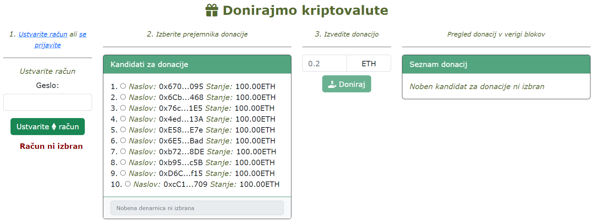
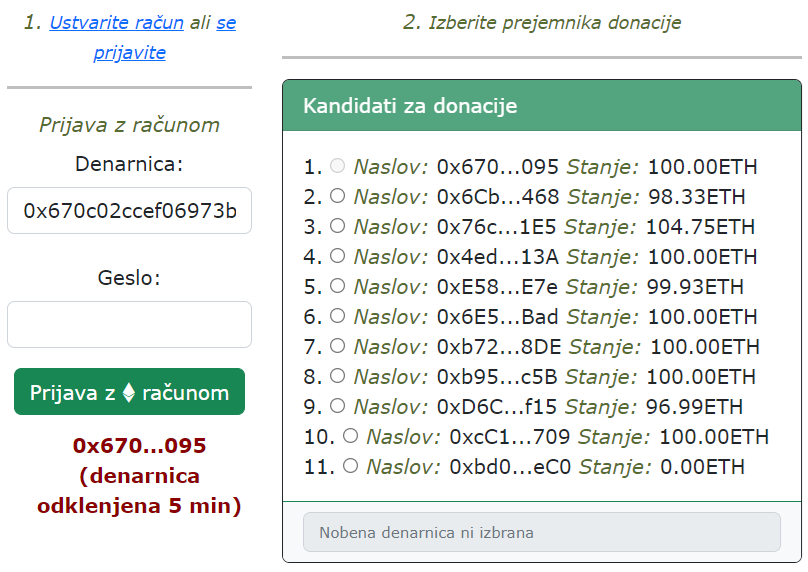
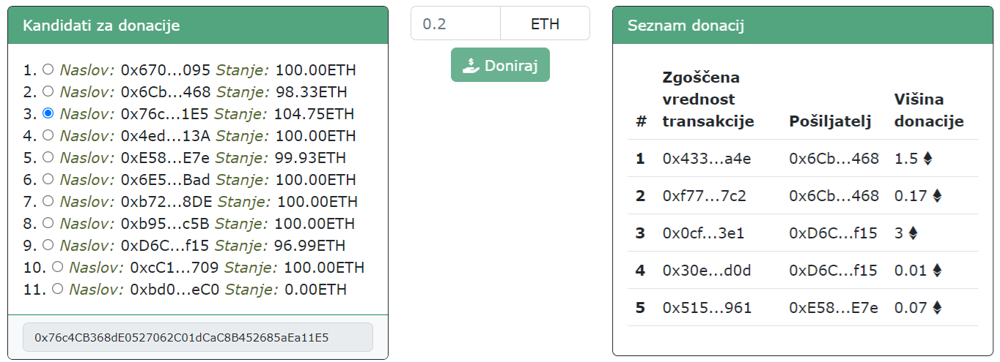

# **V12** uvod v tehnologijo veriženja blokov

Odgovore na vprašanja iz teh vaj lahko posredujete v okviru [ lekcije **V12**](https://ucilnica.fri.uni-lj.si/mod/quiz/view.php?id=55823) na spletni učilnici.

## Vzpostavitev okolja in opis

Na voljo je odjemalska spletna **decentralizirana aplikacija** (angl. decentralized application, dApp) za izvajanje **donacij kriptovalut**.. V okviru vaj popravite in dopolnite obstoječo implementacijo v datoteki `js/skripta.js`, kot zahtevajo navodila. Med delom smiselno uveljavljajte spremembe v lokalnem in oddaljenem repozitoriju!

Pri reševanju vseh nadaljnjih nalog si pomagajte s to dokumentacijo knjižnice [ **Web3.js** ](https://web3js.readthedocs.io/en/v1.10.0/web3-eth-personal.html) različico _1.10.0_.

Zagon aplikacije izvedete tako, da odprite spletno stran `index.html` in pojaviti bi se vam moralo okno, prikazano na naslednji sliki.

   
    <i>Uporabniški vmesnik spletne aplikacije za donacije kriptovalut</i>

> **Opomba**: Za poenostavljeno reševanje naloge so v programski kodi v datoteki `js/skripta.js` na mestih kjer se zahtevajo odgovori podani nizi **`ODGOVOR`** kar posledično na spletni strani prikazuje napake na strani odjemalca. **Nize `ODGOVOR` nadomestite s pravilnimi odgovori oz. rešitvami.**

## Dostop do verige blokov in računi

V okviru tega predmeta in posledično vaj bomo uporabljali lastno privatno verigo blokov, ki jo bomo lokalno zagnali ter dostopali. Ogrodje [ **Ganache**](https://trufflesuite.com/ganache/) nam omogoča enostavni zagon lastne privatne verige blokov Ethereum. Uporabimo jo lahko za izvajanje testov, ukazov in pregleda stanja ter nam tudi omogoča nadzor nad delovanjem verige blokov. Testni sistem lahko na lastnem računalniku poženemo na več načinov, in sicer:

* aplikacija ukazne vrstice [ **truffle develop**](https://trufflesuite.com/docs/truffle/how-to/debug-test/use-truffle-develop-and-the-console/),
* samostojna aplikacija [ **Ganache**](https://trufflesuite.com/ganache/) z grafičnim uporabniškim vmesnikov in
* aplikacija ukazne vrstice [ **ganache**](https://github.com/trufflesuite/ganache).

V okviru vaj bomo pokazali prvi način (truffle develop), ostale lahko preizkusite sami, če vas tematika zanima. Pri razvoju bomo uporabljali ogrodje [ **Truffle Suite**](https://archive.trufflesuite.com/), ki ga namestimo s pomočjo naslednjega ukaza v ukazni vrstici:

~~~~ {.bash}
npm install -g truffle
~~~~

Nato lahko preverimo ali je bila namestitev uspešna in katera verzija je nameščena.

~~~~ {.bash}
truffle --version
~~~~

Nato v korenski mapi vaj ustvarimo novo mapo in se vanjo premaknemo:

~~~~ {.bash}
mkdir dapp
cd dapp
~~~~

Nato v naši prazni mapi dapp inicializiramo Truffle projekt.
~~~~ {.bash}
truffle init
~~~~

Aplikacijo ukazne vrstice [ truffle develop](https://trufflesuite.com/docs/truffle/how-to/debug-test/use-truffle-develop-and-the-console/), ki je del ogrodja Truffle, lahko poženemo v ukazni vrstici:

~~~~ {.bash}
truffle develop --account
~~~~

Primer izpisa uspešno zagnane lokalne privatne verige blokov, kjer so na voljo naslednje osnovne informacije:
* URL naslov za interakcijo z verigo blokov,
* razpoložljivi računi s sredstvi ali naslovi denarnic oz. javni ključi,
* privatni ključi za dostop do denarnic in
* mnemonski stavek.

~~~~ {.bash}
Truffle Develop started at http://127.0.0.1:9545/

Accounts:
(0) 0x670c02ccef06973b63bd0b5bc85f5f35e2f5d095
(1) 0x6cb9c1c2b1dc80aae28b86bea2de0eea97ac7468
(2) 0x76c4cb368de0527062c01dcac8b452685aea11e5
(3) 0x4ed5531e94c9c649b471a393c1a0777aaea0013a
(4) 0xe582c6418bbc45ffb7166958f19696e6367dde7e
(5) 0x6e5bbb895ca6a25daf5fd3dd8566efd38fe2ebad
(6) 0xb7238cab60a7cf2d81da2ed154fc426ade4258de
(7) 0xb95a8a14d44faadcea8ebc440cfb472233d8fc5b
(8) 0xd6c1c767c27d5e0360fbcbc4372bdcdaa8489f15
(9) 0xcc1165aa2194fb52a99cd1534326ad6a875da709

Private Keys:
(0) 1e0ed47c60a5b361019d4f6861ccd772534d113dd17161ff963124a014e5e3df
(1) 67e3159b48b2adc3dac18017bad170a81acebcbe6eecb6064666bd1e36106cd1
(2) 40215b8b8a41b01896324ee0e6d87805fb8b1b44f096680330e278c4694bb825
(3) 870f05ce9c8bd57a0cefc91600376efd205c89ea4b61666c972e2ee176ca4e73
(4) f697cc5c3c74e99e7b298282247eb1011abc4c43cd8b40767fd0eed71c80d9ef
(5) 8daa99398d02ac0e148ee711d9dbdb4058d156cf483e4955dd142f197ca87d7c
(6) cc9c3aadda6cea3aca538875296229d55e280305140767deec427f98a3086205
(7) 56a54d8f69a3c78ac3eaeb38a6fb047c40d8b71943c2f31cccd2d030b6942e11
(8) 9c300c189de6abcbcaa9ca6b4ef6c2813ccfce71e3ce9fd9ee018898c14b6e37
(9) 4d16ac52efa25ebdeab7f3fe0c56e391e70a81147dca23095d363339603ef0bc

Mnemonic: method smoke elephant garage perfect tired announce moment pencil attitude hill horn

⚠️  Important ⚠️  : This mnemonic was created for you by Truffle. It is not secure.
Ensure you do not use it on production blockchains, or else you risk losing funds.
~~~~

## Naloge

### 1. Prijava uporabnika v račun in ustvarjanje računa

Po uspešnem zagonu lokalne privatne verige blokov se osredotočimo na implementacijo funkcionalnosti tehnologije veriženja blokov Ethereum omrežja. Za interakcijo z verigo blokov bomo uporabili knjižnico [ **Web3.js** ](https://web3js.readthedocs.io/en/v1.10.0/web3-eth-personal.html) različica **1.10.0**.

Za pošiljanje sredstev iz računa je potrebno najprej v celoti podpreti 1. korak aplikacije (_1. Ustvarite račun ali se prijavite_) in sicer:
* dostop oz. prijavo uporabnika ter
* ustvarjanje novega računa.

Delovanje prijave je podobno kot običajna prijava, kjer kot enolični identifikator prijave (npr. elektronski naslov, unikatno uporabniško ime, davčna številka, vpisna številka itd.) uporabimo **naslov** našega Ethereum računa, ki se začne z znakoma `0x`, je dolžine 42 znakov, kjer so preostali znaki črke angleške abecede in števila (npr. `0x6809835bEBBB33cC198dB392347786b63460e100`). Pri obstoječih naslovih nam ob zagonu verige blokov (ukaz `truffle develop --account`) so gesla privzetih 10 naslovov **prazni niz** ("").

Pri ustvarjanju računa je poleg omenjenega delovanja prijave še predhodni korak kjer določimo **poljubno geslo** za novo generiran račun.

Pri prijavi je treba ustrezno uporabiti _Web3.js_ funkcijo [`unlockAccount`](https://web3js.readthedocs.io/en/v1.10.0/web3-eth-personal.html#unlockaccount).

Pri generiranju novega naslova denarnice je treba ustrezno uporabiti _Web3.js_ funkcijo [`newAccount`](https://web3js.readthedocs.io/en/v1.10.0/web3-eth-personal.html#newaccount).

> **Namig**: Čas trajanja prijave je opredeljen v datoteki `js/skripta.js` ob uspešni prijavi računa.

   
    <i>Primer uspešne prijave s prvim računom.</i>

### 2. Izvajanje transakcij

Po uspešni prijavi v 2. koraku aplikacije (_2. Izberite prejemnika donacije_) izberemo naslov donacije iz seznama kandidatov za donacije pri čemer ni mogoče izvajati "samodonacije".

Implementirajte izvajanje transakcije prijavljenih uporabnikov. Funkcionalnost naj bo na voljo ob kliku na gumb **Doniraj**, kjer je treba uporabiti _Web3.js_ funkcijo [`sendTransaction`](https://web3js.readthedocs.io/en/v1.10.0/web3-eth.html#sendtransaction) (glej naslednjo sliko).

Enostavno transakcijo je mogoče izvesti s sledečimi parametri:

* pošiljatelj (parameter `from`),
* prejemnik (parameter `to`) in
* količina (parameter `value`).

Vsaka _Ethereum_ (ETH) enota (1 ETH) je na verigi blokov deljiva na 18 decimalnih mest, kjer so enote v predstavljene v celoštevilski obliki. Zato je potrebno vsako enoto množiti s 1018, npr. `1 * Math.pow(10, 18)`.

   
    <i>Prikaza donacije 0,17 ETH sredstev.</i>

### 3. Pregled transakcij

Trenutna rešitev omogoča ob kliku na izbranega prejemnika donacije (2. korak aplikacije) prikaz števila donacij (transakcij). Najprej je potrebno preberiti število vseh blokov z uporabo _web3.js_ funkcije [`getBlock`](https://web3js.readthedocs.io/en/v1.10.0/web3-eth.html#getblock). Dopolnite implementacijo, da se bodo izpisovali podatki o pošiljatelju, prejemniku in količini donacije, ki jih pridobite z uporabo _web3.js_ funkcije [`getTransaction`](https://web3js.readthedocs.io/en/v1.10.0/web3-eth.html#gettransaction). Omejite tudi prikaz donacij tako, da bodo razvidne le tiste donacije, ki vsebujejo izbran račun za donacije v 2. koraku kot prejemnika sredstev transakcije (glej naslednjo sliko).

   
    <i>Primer prikaza donacij računa izbranega v 2. koraku aplikacije</i>

