# **V3** Razvoj enostavnih odjemalskih aplikacij


Za lažje razumevanje vaj si poglejte priprave na vaje iz predavanj [**P2 → V3** HTML in CSS](https://teaching.lavbic.net/OIS/2023-2024/P2-V3.html) ter [**P3 → V3** JavaScript na strani odjemalca](https://teaching.lavbic.net/OIS/2023-2024/admin/P3-V3.html), odgovore na vprašanja iz teh vaj lahko posredujete v okviru [lekcije **V3**](https://ucilnica.fri.uni-lj.si/mod/quiz/view.php?id=55231) na spletni učilnici.

## Vzpostavitev okolja

V trenutnem repozitoriju [**V3**](https://github.com/ois-2023-2024/V3) najprej kreirajte lastno kopijo repozitorija _(angl. Fork)_ tako, da izberete možnost `Fork` zgoraj na desni strani.

> **Namig**: Podrobna navodila za izdelavo lastne kopije repozitorija najdete v navodilih vaj [V2: Kreiranje kopije GitHub repozitorija](https://github.com/ois-2023-2024/V2#kreiranje-kopije-github-repozitorija).

### Zagon odjemalske aplikacije v lokalnem razvojnem okolju WebStorm

Lokalni repozitorij odpremo v lokalnem razvojnim okolju `WebStorm` (npr. _File &rarr; Open_). Lokalne projektne nastavitve ne želimo uveljavljati zato imamo v datoteki `.gitignore` dodano izjemo za uveljavitev in sicer vrstico `.idea`. Na takšen način vsebine mape `.idea` ne bo mogoče uveljavljati v oddaljenem repozitoriju.

Zagon odjemalske aplikacije najpreprostejše izvedemo z desnim miškinim klikom na HTML datoteko `index.html` in izbiro **`Run 'index.html'`** kot prikazuje primer na spodnji sliki. V okviru teh vaj omenjen postopek izvedemo na datoteki `opomniki.html`. Poleg zagona odjemalske aplikacije se v meniju pogostih ukazov doda bližnjica za hiter zagon, ki ga izvedemo s klikom na _zelen trikotnik_ za zagon ali _zelenega hrošča_ za zagon v razhroščevalnem (angl. debug) načinu.

<p align="center">
  <br>
  <i>Primer zagona odjemalske aplikacije v lokalnem razvojnem okolju WebStorm</i>
</p>

### Razhroščevanje v lokalnem razvojnem okolju WebStorm

Lokalno razvojno okolje WebStorm poleg zagona spletnih aplikacij omogoča tudi uporabo razhroščevalnika (angl. debugger) za namene učinkovitejšega iskanja napak ter boljšega razumevanja podatkovnega toka, podpornih ogrodij in splošnega razumevanja delovanja spletnih aplikacij. Več informacij o razhroščevalniku v lokalnem razvojnem okolju WebStorm najdete na [spletnem mestu](https://www.jetbrains.com/help/webstorm/debugging-code.html).

Zagon razhroščevalnika izvedemo na podoben način kot zagon spletne aplikacije tako, da odprete želeno izhodiščno datoteko (npr. `opomniki.html`) in jo poženete z ukazom `Debug ...`. V pasici lokalnega razvojnega okolja Webstorm, v pasici pogostih ukazov je na voljo bližnjica za zagon razhroščevalnika kot prikazuje naslednja slika.

<p align="center">
  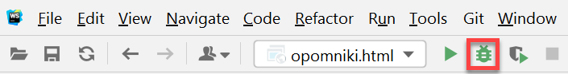<br>
  <i>Primer zagona razhroščevalnika iz pasice pogostih ukazov v lokalnem razvojnem okolju WebStorm</i>
</p>

Primer delovanja razhroščevalnika v WebStorm z orisom osnovnih komponent ter funkcionalnosti prikazuje naslednja slika.

<p align="center">
  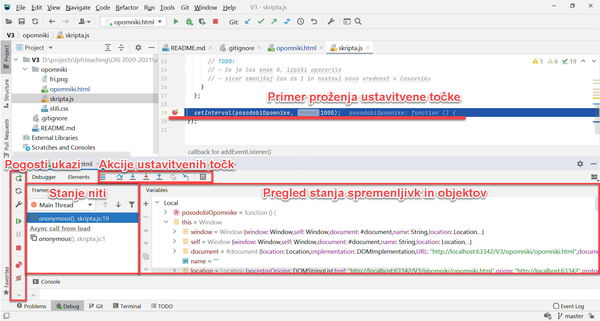<br>
  <i>Primer prikaza delovanja razhroščevalnika z osnovnimi komponentami</i>
</p>

> Pri dolgoročni uporabi lokalnega razvojnega okolja WebStorm je smiselno poznati [<span class='fas fa-globe-europe' style='padding-right:3px'></span>osnovne bližnjice ukazov z zgolj uporabo tipkovnice](https://www.jetbrains.com/help/webstorm/mastering-keyboard-shortcuts.html). Vse razpoložljive bližnjice tipkovnice so na voljo za operacijske sisteme [<span class='fas fa-globe-europe' style='padding-right:3px'></span>Linux/MS Windows](https://www.shortcutfoo.com/app/dojos/webstorm-phpstorm-win/cheatsheet) in operacijske sisteme [<span class='fas fa-globe-europe' style='padding-right:3px'></span>macOS](https://www.shortcutfoo.com/app/dojos/webstorm-phpstorm-mac/cheatsheet).

## Naloga

V korenski mapi se nahaja delno izdelana spletna stran `opomniki.html` s pripadajočo stilsko datoteko `stili.css` ter logiko na strani odjemalca v datoteki `skripta.js`. Ker je razvijalcem majhnega zagonskega podjetja zmanjkalo časa za dokončno izdelavo spletne strani, je vaša naloga, da najprej poskrbite za stilsko preobrazbo in nato še podprete funkcionalnosti.

### HTML in CSS

1. Znotraj gradnika `<body>` HTML datoteke `opomniki.html` dopolnite nepopolno opredeljeni HTML element tipa `<input>` z ustreznimi podatki, ki naj odražajo:

    * element naj bo **besedilno polje**,
    * predloga besedilnega polja naj vsebuje napis **`Vnesite iskalni niz`**, kot to prikazuje naslednja slika.

<p align="center">
  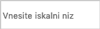<br>
  <i>Vnosno polje s predlogo</i>
</p>

2. Popravite 1. celico v 1. vrstici tabele z besedilom `Teden` tako, da bo prikazan čez vse vrstice tabele, kot to prikazuje naslednja slika.

<p align="center">
  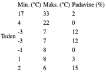<br>
  <i>Vsebina celice tabele čez več vrstic</i>
</p>

3. Zamenjajte izbrane `<td>` HTML elemente z ustreznimi HTML elementi tako, da bo **prva vrstica v tabeli** postala **naslovna**, kjer bo **besedilo privzeto prikazano odebeljeno**, kot to prikazuje naslednja slika.

<p align="center">
  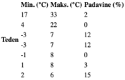<br>
  <i>Privzeto odebeljena glava tabele</i>
</p>

4. **Popravite** napačno **opredelitev CSS izbirnika razreda `osnovna`** v datoteki `stili.css`, ki je že pravilno referenciran v HTML datoteki `opomniki.html`, na celotno naslovno vrstico tabele. Z uspešno spremembo se spremeni izgled tabele, kot ga prikazuje naslednja slika.

<p align="center">
  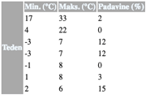<br>
  <i>Dodan slog glave tabele</i>
</p>

5. Na spletni strani so znotraj HTML gradnika `<navigacija>` na voljo spletne povezave `Domov`, `Zanimivosti`, `Opomniki` in `Kontakt`, ki imajo opredeljen CSS razred `element` in posledično se vse omenjene povezave prikažejo na spletni strani v odebeljeni obliki. Trenutni izgled spremenite tako, da obstoječi razred spremenite v psevdo razred, ki bo povezave prikazal odebeljene zgolj ob prehodu z miško.

<p align="center">
  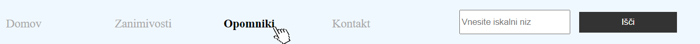<br>
  <i>Odebeljene povezave ob prehodu z miško</i>
</p>

6. Vsi naslovi so privzeto črne barve. V datoteko `stili.css` dodajte ustrezen CSS slog, ki bo **barvo naslovov na prvih treh ravneh** spremenil v **temno rdečo** (ime barve je `darkred`).

7. Dopolnite CSS slog povezav `a` znotraj razreda `navigacija`, da bo **besedilo prikazano z velikimi tiskanimi črkami** in **dodajte levi odmik za `20px`**, kot to prikazuje naslednja slika. Spremembo uveljavite zgolj v datoteki `stili.css`, medtem ko izvorna koda besedila v datoteki `opomniki.html` ostane nespremenjena.

<p align="center">
  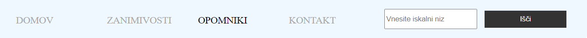<br>
  <i>Velike črke povezav in levi odmik</i>
</p>

8. Vsem osrednjim gradnikom spletne strani (tj. `navigacija`, `vsebina`, `desni-meni` in `noga`) **dodajte senco** in **rob** (glej naslednjo sliko), ki sta že opredeljena v istoimenskem CSS razredu.

<p align="center">
  <br>
  <i>Sence in robovi</i>
</p>

9. Na spletni strani `opomniki.html` dodajte sliko `sonceOblaki.png`, ki se nahaja v mapi `slike`. Slika naj bo pozicionirana v HTML razredu `vsebina` z relativno velikostjo `20%` širine zaslona in s prosojnostjo `40%`, kot to prikazuje naslednja slika.

<p align="center">
  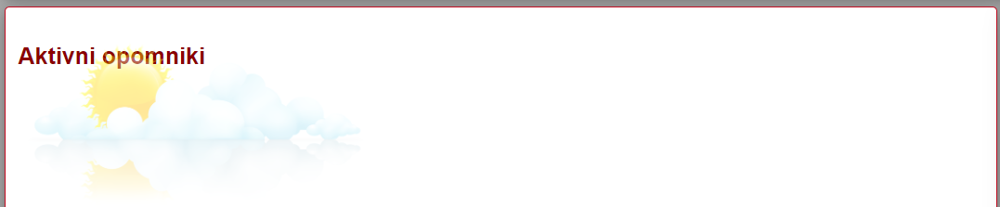<br>
  <i>Dodana slika</i>
</p>

### JavaScript na strani odjemalca

> **Opomba**: Za poenostavljeno reševanje naloge so v programski kodi v datoteki `skripta.js` na mestih kjer se zahtevajo odgovori podani nizi **`ODGOVOR`** kar posledično na spletni strani prikazuje napake na strani odjemalca. **Nize `ODGOVOR` nadomestite s pravilnimi odgovori oz. rešitvami**.

10. V zaglavje HTML datoteke `opomniki.html` **dodajte povezavi** na datoteko z Javascript kodo (`skripta.js`).

11. Prvotno **prijavno masko** na dnu nastavite, da je **15% prosojna**, da se lahko vidijo tudi spodnje komponente vključno z nogo, kot to prikazuje naslednja slika. Spremembo izvedite v datoteki `stili.css`.

<p align="center">
  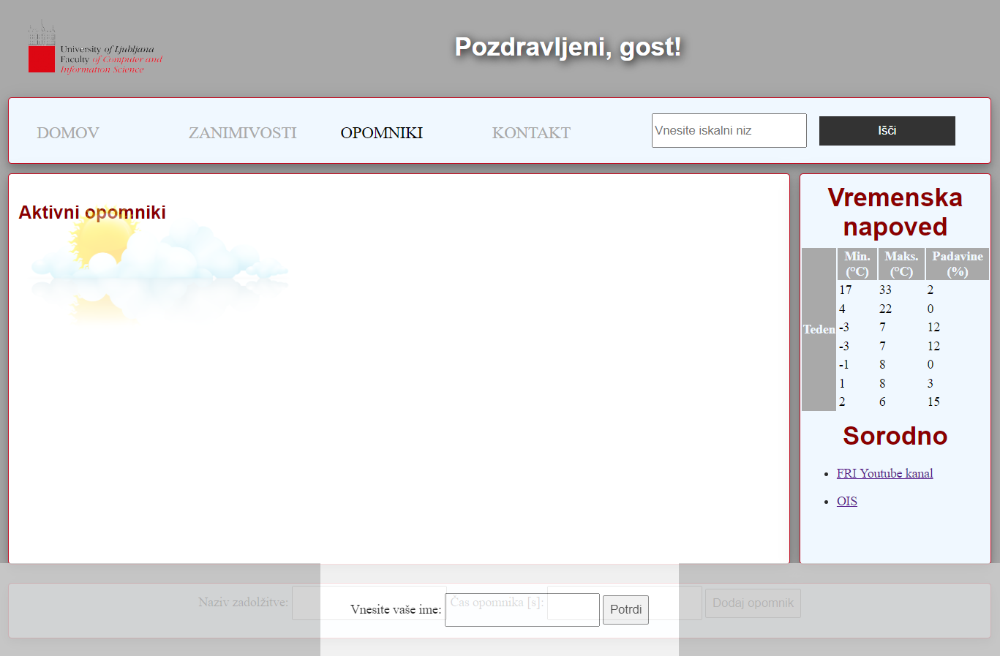<br>
  <i>Prosojnost uporabniškega vmesnika</i>
</p>

12. Dokončajte implementacijo **funkcije** `izvediPrijavo `, ki naj se izvede **ob kliku na gumb `Potrdi`** (na HTML gradniku uporabimo metodo `addEventListener('click', metodaKiSeIzvede)`). Funkcija naj stori sledeče:

    * pridobi vrednost vnešenega imena z uporabo metode `document.querySelector` (glej spodnji namig) in lastnosti `value`,
    * nastavi vrednost vnešenega imena kot HTML vsebino (lastnost `innerHTML`) v polje z ID-jem `uporabnik` (glej naslednjo sliko),
    * skrije prekrivno okno (HTML element s stilom `pokrivalo`, kjer lahko uporabimo lastnost `style.visibility`), da se pokaže glavna vsebina strani.

> **Namig**: Če želimo dostopati do HTML gradnika z razredom `imeRazreda`, potem uporabimo `document.querySelector('.imeRazreda')`, če pa želimo dostopati do HTML gradnika z ID-jem `id`, potem uporabimo `document.querySelector('#id')`.

<p align="center">
  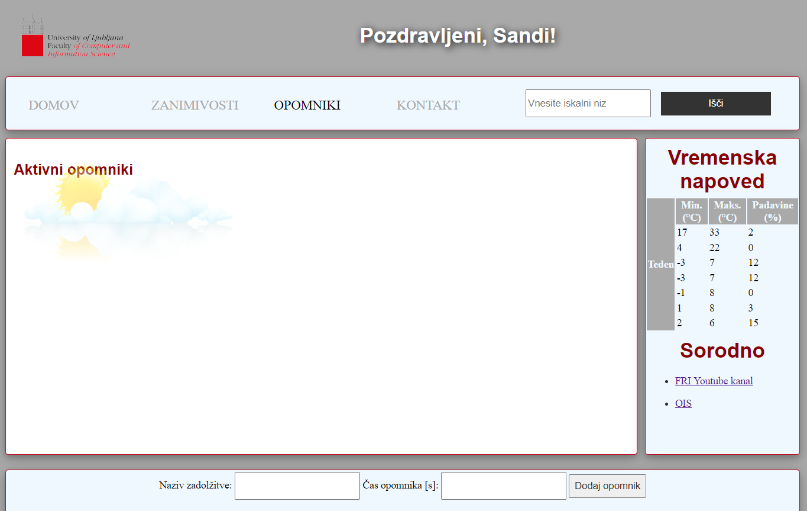<br>
  <i>Prikaz vnesenega imena uporabnika</i>
</p>

13. Vaše spremembe shranite s sporočilom uveljavitve `Implementirana prijava` in spremembe uveljavite na oddaljenem git strežniku.

14. V svojem repozitoriju **ustvarite razvojno vejo z imenom `opomniki`** ter nadaljujte razvoj v novi veji.

15. Dokončajte implementacijo **funkcije `dodajOpomnik`**, ki se izvede ob kliku na gumb `Dodaj opomnik`. Funkcija naj stori sledeče (glej naslednjo sliko):

    * pridobi vneseni vrednosti za naziv in čas trajanja opomnika,
    * resetira vrednosti vnosnih polj,
    * v HTML element z ID-jem `opomniki` doda sledečo HTML kodo, v katero vstavite vrednosti, ki jih je vnesel uporabnik:
    <ul class="odmik">

    ````{html}
    <div class='opomnik'>
      <div class='naziv_opomnika'>NAZIV_OPOMNIKA</div>
      <div class='cas_opomnika'> Opomnik čez <span>CAS_OPOMNIKA</span> sekund.</div>
    </div>
    ````
    </ul>

<p align="center">
  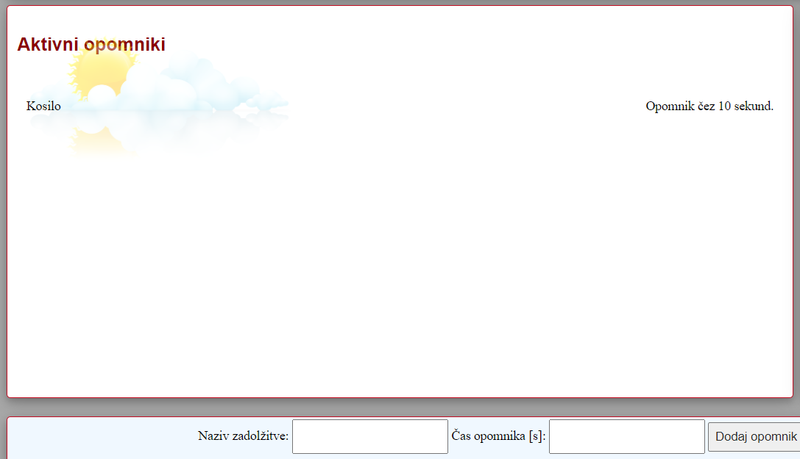<br>
  <i>Dodan opomnik</i>
</p>

16. Ko vam dodajanje novih opomnikov deluje, uveljavite spremembe v vašo trenutno vejo s komentarjem `Dodajanje opomnikov`. Spremembe uveljavite tudi na istoimenski oddaljeni veji in nato **združite spremembe v glavno vejo `main`**. Razvoj nadaljujte na glavni veji razvoja.

17. V spodnjem delu dokumenta `skripta.js` boste opazili **del kode, ki posodablja opomnike**. Vrstica `setInterval(posodobiOpomnike, 1000)` definira, da se funkcija `posodobiOpomnike` pokliče enkrat na sekundo. Zaradi časovnih omejitev predhodnih razvijalcev pa funkcija ni popolnoma implementirana, zato jo dokončajte, da bo funkcionalnost takšna, kot to prikazuje naslednja slika.

<p align="center">
  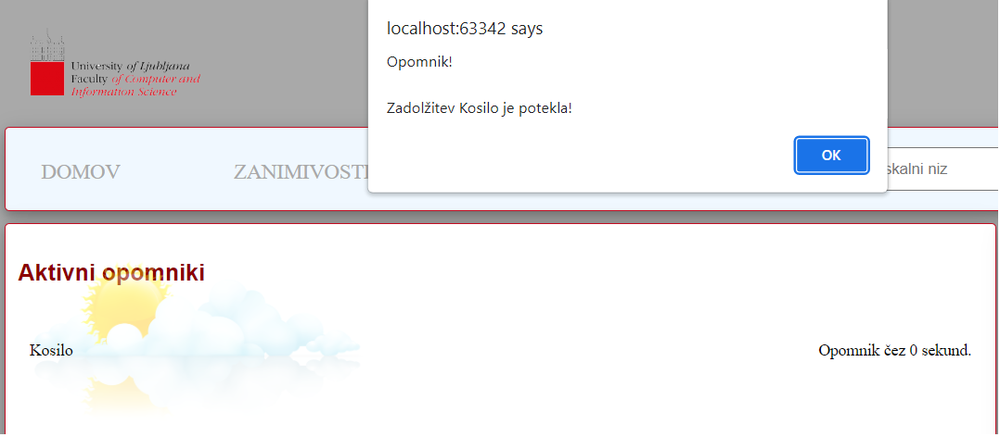<br>
  <i>Opozorilo ob poteku opomnika</i>
</p>

> **Namig**: Ko opomnik poteče, uporabniku prikažite opozorilo z vsebino `Opomnik!\n\nZadolžitev NAZIV_OPOMNIK je potekla!` (glej zgornjo sliko) in ga izbrišite iz strani (glej naslednjo sliko).

<p align="center">
  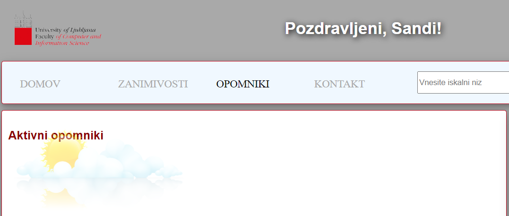<br>
  <i>Brez opomnikov</i>
</p>

18. Poskrbite za **lepši grafični izgled** spletne strani tako, da dodajte že pripravljena stila `senca` in `rob` komponenti ob dodajanju novega opomnika kot prikazuje primer na naslednji sliki.

<p align="center">
  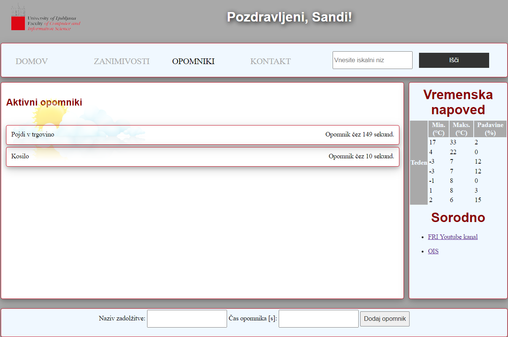<br>
  <i>Končni izgled uporabniškega vmesnika</i>
</p>

19. Uveljavite spremembe na glavni veji s komentarjem `Stran pripravljena za produkcijo` in spremembe posredujte tudi v oddaljeni repozitorij.