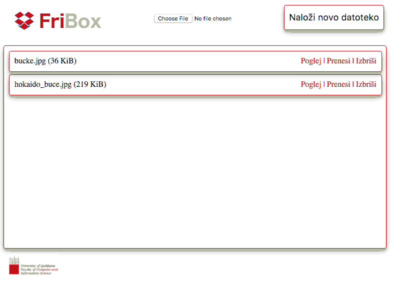
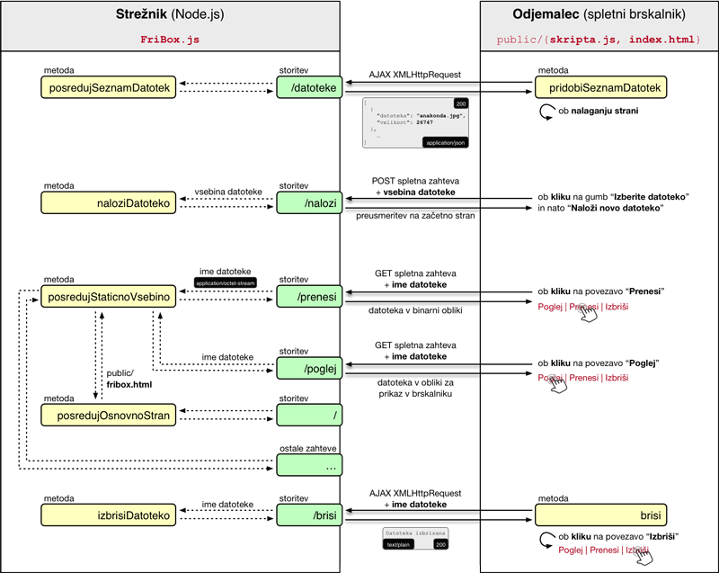
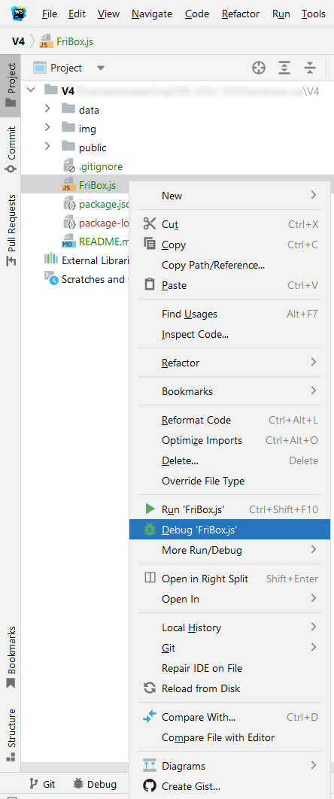
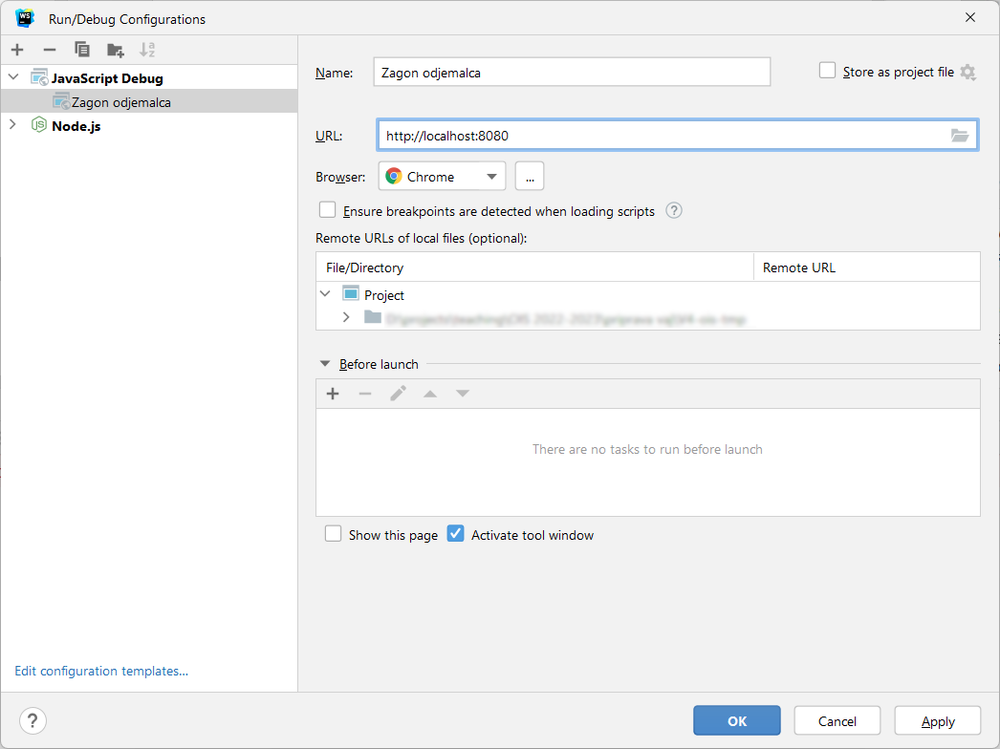

# **V4** Node.js in razvoj odjemalec/strežnik aplikacij

Za lažje razumevanje vaj si poglejte priprave na vaje iz predavanj P2.1 &rarr; V4 [Odjemalec/strežnik in Node.js](#Odjemalec-streznik-in-Node-js), odgovore na vprašanja iz teh vaj lahko posredujete v okviru [lekcije **V4**](https://ucilnica.fri.uni-lj.si/mod/quiz/view.php?id=55308) na spletni učilnici.

## Spletna storitev FriBox

**FriBox** predstavlja napredno storitev za oblačno shranjevanje in deljenje datotek. Kot izvrstna spletna aplikacija posega na izjemno konkurenčno področje obstoječih tovrstnih rešitev.

V okviru vaj ustvarite kopijo repozitorija in popravite ter dopolnite obstoječo nepopolno implementacijo, tako da bo končna aplikacija z vsemi delujočimi funkcionalnostmi izgledala kot na naslednji sliki. Med delom smiselno uveljavljajte spremembe v lokalnem in oddaljenem repozitoriju!

   
  <i>Prikaz osnovnega delovanja spletne storitve FriBox</i>

Arhitekturna zasnova spletne storitve FriBox je oblikovana v smeri mikrostoritev in je prikazana na naslednji sliki. Pomembno je razlikovanje med odgovornostjo in **izvajanjem na strani odjemalca** oz. spletnega brskalnika (desna stran naslednje slike) in **izvajanjem na strani** (Node.js) **strežnika** (leva stran naslednje slike).

Za doseganje večje interaktivnosti delovanja aplikacije se nekatere funkcionalnosti (npr. pridobitev seznama datotek na strežniku in brisanje izbrane datoteke) izvajajo s pomočjo AJAX zahtev, kjer ob spremembi manjšega dela spletne strani ni potrebno osvežiti celotne strani.

   
  <i>Arhitekturna zasnova spletne storitve FriBox</i>

Opisana aplikacija je delno razvita in jo boste morali v okviru teh vaj razviti do konca, da bo arhitekturno ustrezala stanju na zgornji sliki in podpirala funkcionalnosti, prikazane na sliki oz. animaciji osnovnega delovanja.

### Razhroščevanje odjemalca in strežnika v lokalnem razvojnem okolju WebStorm

Najprej izvedemo razhroščevanje izvajanja **na strani strežnika** v orodju WebStorm tako, da izberemo datoteko, ki jo želimo pognati v načinu razhroščevanja. To lahko izvedemo na dva načina in sicer:
1. (hitrejši način) V primeru tekoče vaje je strežnik datoteka `FriBox.js` kjer razhroščevanje izvršimo z desnim klikom miške in izberemo `Debug 'FriBox.js'` kot je prikazano v naslednji sliki.

   
   <i>Primer zagona razhroščevalnika za strežnik v Webstorm</i>

2. V drugem načinu nastavitve razhroščevanja strežnika nastavimo ročno tako, da definiramo novo konfiguracijo razhroščevanja z gumbom v vrstici bližnjic _Edit Configurations..._. Nato izberemo dodajanje nove konfiguracije z gumbom `+`  ter izberemo vrsto aplikacije `Node.js`. V nastavitvah konfiguracije izberemo poljubno ime v vnosnem polju `Name:` (npr. `Zagon strežnika`), ter v vnosnem polju `JavaScript file:` vnesemo ali izberemo datoteko strežnika (npr. v trenutni vaji `FriBox.js`) in na koncu potrdimo konfiguracijo z gumbom `Apply` ali gumbom `OK` kot prikazuje naslednja slika.

   
   <i>Primer nastavitev zagona razhroščevalnika strežnika v Webstorm</i>

Razhroščevanje izvajanja **na strani odjemalca** v orodju WebStorm je mogoče izvesti tako, da definiramo novo konfiguracijo razhroščevanja z gumbom v vrstici bližnjic _Edit Configurations..._. Nato izberemo dodajanje nove konfiguracije z gumbom `+`  ter izberemo vrsto aplikacije `JavaScript Debug`. V nastavitvah konfiguracije izberemo poljubno ime v vnosnem polju `Name:` (npr. `Zagon odjemalca`), ter v vnosnem polju `URL` vnesemo osnovni URL aplikacije `http://localhost:8080` in na koncu potrdimo konfiguracijo z gumbom `Apply` ali gumbom `OK` kot prikazuje naslednja slika.

   
   <i>Slika: Primer nastavitev zagona razhroščevalnika odjemalca v Webstorm</i>

## Navodila

> **Opomba**: Za poenostavljeno reševanje naloge so v programski kodi na mestih kjer se zahtevajo odgovori podani nizi **`ODGOVOR`** kar posledično na spletni strani prikazuje napake na strani odjemalca ali strežnika. Pri nekaterih nalogah kjer je v obliki komentarja navedeno je potrebno odstraniti večvrstični komentar (niza `/*` in `*/`). **Nize `ODGOVOR` nadomestite s pravilnimi odgovori oz. rešitvami**.

1. Na Githubu z uporabo funkcije _Fork_ ustvarite lastno kopijo zasebnega repozitorija [V4](https://github.com/ois-2023-2024/V4), v okviru katere boste izvedli spodnje aktivnosti. V ukazni vrstici uvozite svojo kopijo FriBox repozitorija in delo nadaljujte v lokalnem razvojnem okolju _WebStorm_. Rešitev strežnika je razvita z uporabo ogrodja **[Node.js](https://nodejs.org/en/)**, kjer namestite zadnjo stabilno različico (`LTS`) v vašem lokalnem okolju.

   > Navodila za vzpostavitev okolja so na voljo v okviru vaj _V2_ v poglavju [Vzpostavitev okolja](https://github.com/ois-2023-2024/V2#vzpostavitev-okolja).

2. V datoteki `package.json` aplikaciji dodelite odvisne knjižnice `mime-types`, `formidable` in `fs-extra` ter jih namestite z ukazom **`npm install`** pri čemer se ustvari mapa `node_modules` kjer se nahajajo vse omenjene knjižnice vključno s soodvisnimi. Ker lokalno nameščenih knjižnic znotraj mape `node_modules` ne želimo uveljavljati se mapa nahaja kot `git` izjema uveljavitve v datoteki `.gitignore`. V Node.js aplikaciji, ki je implementirana v datoteki `FriBox.js`, popravite implementacijo tako, da ta zažene strežnik na privzetih vratih. Nato zaženite aplikacijo `FriBox.js` z desnim miškinim klikom ter izbiro `Run 'FriBox.js'` ali z ukazom **`node FriBox.js`**. Ko zaženete Node strežnik, je vaša spletna aplikacija dostopna na spletnem naslovu **[http://localhost:8080](http://localhost:8080)**.

3. V JavaScript datoteki `public/skripta.js` popravite implementacijo tako, da se pri nalaganju strani izvede funkcija `pridobiSeznamDatotek()`, ki pridobi seznam datotek s strežnika. Popravite tudi samo implementacijo funkcije tako, da dejansko pošlje zahtevek za seznam datotek spletni storitvi `/datoteke`.

   > Na tem mestu se uporabi **AJAX zahteva**, ki jo sproži odjemalec (v datoteki `public/skripta.js`) in jo posreduje strežniku. Implementacija na strani strežnika se nahaja v datoteki `FriBox.js` v vrsticah 17&ndash;18, in sicer ob zahtevi `/datoteke`. Na strežniku se nato preberejo lokalne datoteke v mapi `data` in se kot JSON odgovor posredujejo nazaj odjemalcu (vrstice 73&ndash;90).

4. V JavaScript datoteki `skripta.js`, ki se izvede na strani odjemalca, popravite implementacijo tako, da bo izpis seznama datotek prilagojen velikosti posamezne datoteke. Izpis velikosti datotek naj bo v _B_, v kolikor je velikost datoteke manjša od _1 KiB_, v _KiB_, v kolikor je velikost datoteke manjša od _1 MiB_, v _MiB_, v kolikor je velikost datoteke manjša od _1 GiB_ itd.

5. V Node.js aplikaciji `FriBox.js` na strani strežnika popravite implementacijo tako, da se ob klicu spletne storitve `/poglej` odjemalcu posreduje datoteka z uporabo funkcije `posredujStaticnoVsebino()`. Nato v JavaScript skripti `skripta.js` (na strani odjemalca) popravite implementacijo tako, da vsem datotekam dodate gumb `Poglej`, ki z uporabo spletne storitve `/poglej` (na strani strežnika) izbrano datoteko prikaže v novem zavihku.

   > **Namig**: Implementacija storitve `/poglej` je skoraj identična implementaciji storitve `/prenesi`, z manjšo razliko, da pri pogledu nastavimo `Content-Type` (zadnji parameter metode `posredujStaticnoVsebino`) na prazen niz "", kar povzroči, da brskalnik poskuša datoteko prikazati, če jo seveda pozna.

6. Node.js aplikaciji `FriBox.js` dodajte implementaciji dveh funkcij za posredovanje HTTP napak `404` in `500`. Funkciji uporabite na ustreznih mestih v aplikaciji, ki so opredeljeni s klicem funkcije za posredovanje napake `posredujNapakoODGOVOR(odgovor);` pri čemer je potrebno navesti pravilno ime funkcije.

   > **Namig**: Pri določitvi ustrezne napake se vprašajte predvsem, kdo je odgovoren za napako: odjemalec (`404`) ali strežnik (`500`).

7. V Node.js aplikaciji `FriBox.js` dodajte implementacijo funkcije `izbrisiDatoteko()`, ki z uporabo funkcije `fs.unlink()` izbriše posredovano datoteko in vrne ustrezen odgovor. Nato v JavaScript skripti `skripta.js` poiščite napako v implementaciji, zaradi katere je moč izbrisati le prvo datoteko na strani. Popravite implementacijo tako, da bo moč izbrisati poljubno datoteko in preverite delovanje.

   > **Namig**: Pri zahtevi za brisanje na strani odjemalca (v datoteki `skripta.js`) bodite pozorni na uporabo metode `document.querySelector`, ki vrača zgolj prvi zadetek na strani. Obstaja namreč tudi metoda `document.querySelectorAll`, ki vrača vse zadetke na strani v obliki tabele. Če se sprehodite po elementih tabele, ki predstavljajo posamezne povezave za brisanje, lahko vsaki posebej dodate dogodek klika z miško, kjer se pokliče metoda `brisi`.
   
8. V Node.js aplikaciji _FriBox.js_ pri nalaganju datotek dodajte preverjanje, ali datoteka z enakim imenom že obstaja. V tem primeru posredujte HTTP napako `409`. Bodite previdni, da odjemalcu za poizvedbo odgovora ne posredujete večkrat.