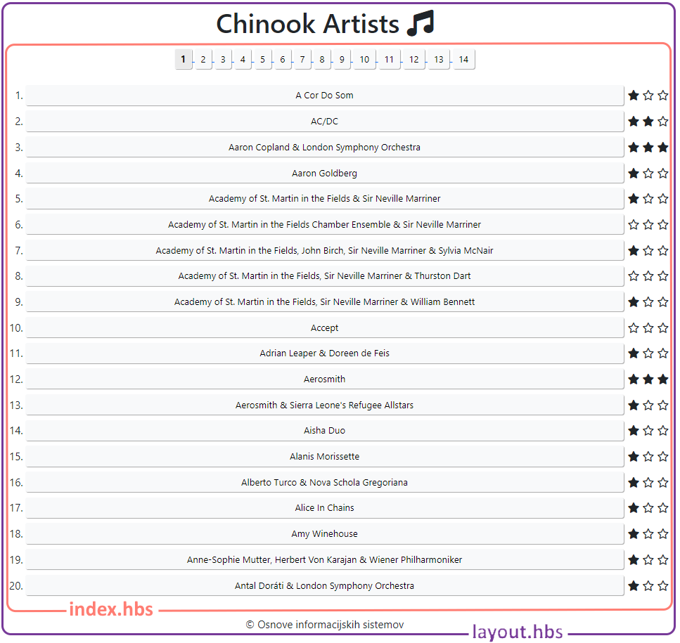
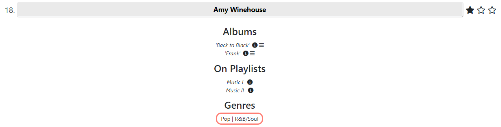
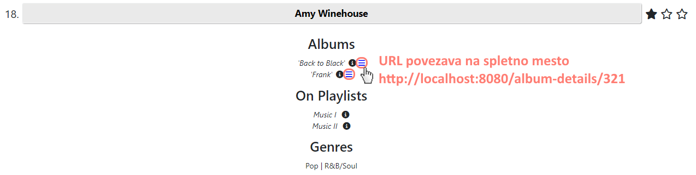
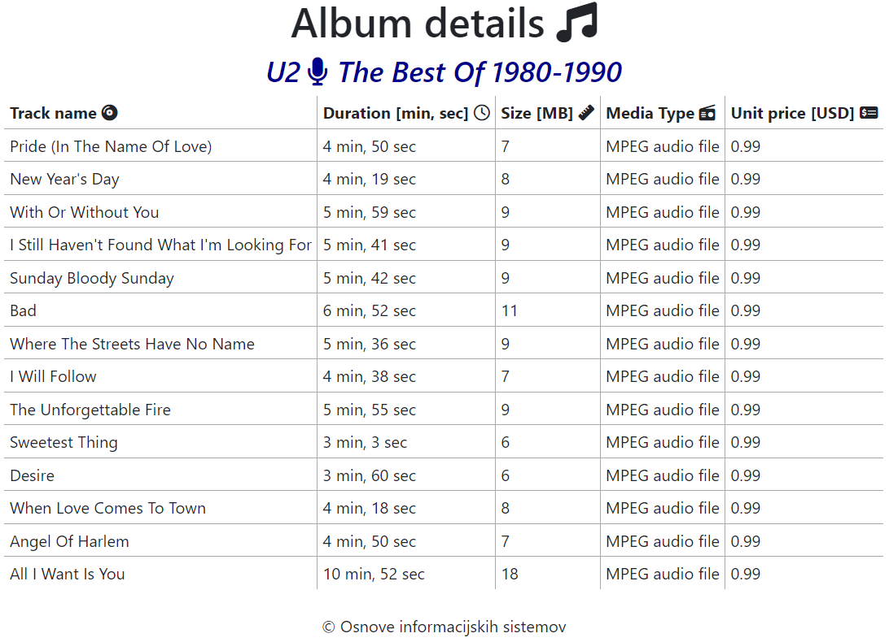

# **V5** Pregled pesmi iz podatkovne baze

Za lažje razumevanje vaj si poglejte priprave na vaje iz predavanj P2.3 &rarr; 
V5 [Povezovanje na podatkovno bazo](https://teaching.lavbic.net/OIS/2023-2024/P5-V5.html), odgovore na vprašanja
iz teh vaj lahko posredujete v okviru [lekcije **V5**](https://ucilnica.fri.uni-lj.si/mod/quiz/view.php?id=55309) na
spletni učilnici.

## Vzpostavitev okolja

Na voljo je Node.js spletna aplikacija, ki se povezuje do podatkovne
baze [Chinook](https://m-soro.github.io/Business-Analytics/SQL-for-Data-Analysis/L4-Project-Query-Music-Store/) (z
dodano tabelo `Stars`). Z uporabo funkcije _Fork_ ustvarite lastno kopijo repozitorija in v okviru vaj popravite in
dopolnite obstoječo implementacijo, kot zahtevajo navodila. Med delom smiselno uveljavljajte spremembe v lokalnem in
oddaljenem repozitoriju!

> Pred začetkom dela je potrebno namestiti vse potrebne knjižnice z ukazom `npm install`. Osrednja aplikacija se nahaja
> v datoteki `app.js`.

## Opis delovanja

### Funkcionalnosti

Prikaz osnovnih funkcionalnosti je na voljo na
sledečem [videu](https://www.youtube.com/watch?v=78unGjhtC5A&ab_channel=DejanLavbi%C4%8D).

### Tehnične podrobnosti

Aplikacija za pregled pesmi iz podatkovne baze ima implementirane številne storitve, ki so navedene v spodnji tabeli:

<table>
    <thead>
    <tr>
        <th style="text-align:left;">
            Storitev
        </th>
        <th style="text-align:left;">
            Opis
        </th>
    </tr>
    </thead>
    <tbody>
    <tr>
        <td style="text-align:left;">
            <code>/artists</code>
        </td>
        <td style="text-align:left;">
            Vrne <strong>seznam izvajalcev</strong>.
        </td>
    </tr>
    <tr>
        <td style="text-align:left;">
            <code>/artists/:page</code>
        </td>
        <td style="text-align:left;">
            Ker je <strong>izvajalcev</strong> veliko, jih prikažemo <strong>po straneh</strong>, kjer je v parametru
            <code>:page</code> podana stran izpisa, ki jo želimo.
        </td>
    </tr>
    <tr>
        <td style="text-align:left;">
            <code>/artists/:page/details/:artist</code>
        </td>
        <td style="text-align:left;">
            Vrne <strong>podrobnosti</strong> (detail) posameznega <strong>izvajalca</strong> <code>:artist</code>, kjer
            je prikazana stran <code>:page</code> (master).
        </td>
    </tr>
    <tr>
        <td style="text-align:left;">
            <code>/albums/:artist</code>
        </td>
        <td style="text-align:left;">
            Vrne <strong>vse albume</strong> izbranega <strong>izvajalca</strong> <code>:artist</code>.
        </td>
    </tr>
    <tr>
        <td style="text-align:left;">
            <code>/album/:album</code>
        </td>
        <td style="text-align:left;">
            Vrne <strong>podrobnosti</strong> izbranega <strong>albuma</strong> <code>:album</code>.
        </td>
    </tr>
    <tr>
        <td style="text-align:left;">
            <code>/playlist/:playlist</code>
        </td>
        <td style="text-align:left;">
            Vrne <strong>podrobnosti</strong> izbranega <strong>seznama predvajanja</strong> <code>:playlist</code>.
        </td>
    </tr>
    <tr>
        <td style="text-align:left;">
            <code>/stars/:artist/:stars</code>
        </td>
        <td style="text-align:left;">
            Posodobi <strong>število zvezdic</strong> <code>:stars</code> izbranega <strong>izvajalca</strong> <code>:artist</code>
            in vrne to vrednost kot odgovor.
        </td>
    </tr>
    <tr>
        <td style="text-align:left;">
            <code>/pages</code>
        </td>
        <td style="text-align:left;">
            Vrne <strong>število strani izvajalcev</strong>.
        </td>
    </tr>
    <tr>
        <td style="text-align:left;">
            <code>/album-details/:album</code>
        </td>
        <td style="text-align:left;">
            Vrne <strong>podrobnosti pesmi izbranega albuma</strong> <code>:album</code> in sicer ime izvajalca ter seznam vseh pesmi
            albuma.
        </td>
    </tr>
    </tbody>
</table>

V aplikacijo smo uvedli tudi novo funkcionalnost, in sicer **uporabo vnaprej pripravljenih parametriziranih pogledov** s
pomočjo [Handlebars](https://handlebarsjs.com/).
Funkcionalnost smo omogočili v datoteki `app.js`. Ogrodje aplikacije se nahaja v privzeti razporeditvi v
datoteki `views/layout.hbs`, medtem ko se vsebina pogledov nahaja v datotekah  `views/index.hbs` in `views/album-details.hbs`.

`app.js`

~~~~ {.javascript}
app.set('view engine', 'hbs');
~~~~

Točna vrednost pogleda se nastavlja preko parametrov, kar prikazuje naslednji primer.

**Primer klica parametriziranega pogleda** `index.hbs` lahko najdemo pri prikazu seznama izvajalcev v spodnji kodi, kjer
s klicem `response.render('index', {title: "Chinook Artists", artists: result})` zahtevamo prikaz pogleda z imenom `index` in mu posredujemo
parameter `title` z vsebino niza `"Chinook Artists"` ter parameter `artists` z vsebino objekta `result`.

`app.js`

~~~~ {.javascript}
// Responds with specified page's artists
app.get("/artists/:page", (request, response) => {
    artists(request.params.page, -1, "", (result) => {
        response.render("index", {title: "Chinook Artists", artists: result});
    });
});
~~~~

Pogled **privzete razporeditve `layout.hbs`** se v celoti prikaže odjemalcu, medtem ko se vrstica `{{{body}}}`, ki predstavlja parameter `body`, zamenja s posredovano vsebino **izbranega pogleda `index.hbs`** (v našem primeru je to vrednost spremenljivke `result`, kot je prikazano zgoraj). Primer gnezdenja pogleda `index.hbs` v prevzeti razporeditvi `layout.hbs` prikazuje naslednja slika.

   
    <i>Privzeta razporeditev `layout.hbs` vsebuje osnovne JavaScript knjižnice, CSS
stile in nogo. Pogled `index.hbs` vsebuje vsebino pesmi. Na sliki je prikazan končen izgled prve strani seznama izvajalcev.</i>

`views/layout.hbs`

~~~~ {.html}
<html lang="en">
<head>
    <meta charset="utf-8"/>
    <meta name="viewport" content="width=device-width, initial-scale=1, shrink-to-fit=no"/>
    <title>Chinook Artists</title>
    <link href="https://cdn.jsdelivr.net/npm/bootstrap@5.1.3/dist/css/bootstrap.min.css" rel="stylesheet"/>
    <link href="https://cdnjs.cloudflare.com/ajax/libs/font-awesome/6.3.0/css/all.min.css" rel="stylesheet"/>
    <link rel="stylesheet" href="/css/style.css"/>
</head>

<body>
    

        <h1>{{title}} <i class="fa-solid fa-music"></i></h1>
    

    {{{body}}}
    
&copy; Osnove informacijskih sistemov

    
    
    
    
</body>
</html>
~~~~

Handlebars poleg uporabe **osnovnih parametrov** `{{spremenljivka}}` ter **parametrov, ki interpretirajo HTML vsebino** `{{{htmlVsebina}}}`, omogoča tudi **pogojne stavke** (npr. `{{#if ...}} vsebina {{/if}}` pri čemer se vsebina prikaže, v primeru, da je rezultat pogoja `true` sicer ostane skrita), **for zanke** (npr. iteriraj vsebino seznama `artist.stars` ter izpiši poljubno vsebino za vsak element, primer `{{#each  artist.stars as | star |}} <i stars="{{star.number}}" class="fa-solid fa-star"></i> {{/each}}`) in druge komponente, ki v splošnem poenostavijo prikaz vsebine.

`views/index.hbs`

~~~~ {.html}

    

        

            

            

                {{#each artists as | artist |}}
                    
{{artist.number}}.
                        <a href="{{artist.url}}">
                            <button type="button" class="btn btn-light btn-sm {{artist.buttonState}}">
                                {{artist.name}}
                            </button>
                        </a>
                        
                            {{#each  artist.stars as | star |}}
                                <i stars="{{star.number}}" class="fa-solid fa-star"></i>
                            {{/each}}
                            {{#each  artist.starsEmpty as | star |}}
                                <i stars="{{star.number}}" class="fa-regular fa-star"></i>
                            {{/each}}
                        
                        {{#if artist.details}}
                            

                                {{{artist.details}}}
                            

                        {{/if}}
                    

                {{/each}}
            

        

    

~~~~

## Naloga

> **Opomba**: Za poenostavljeno reševanje naloge so v programski kodi na mestih kjer se zahtevajo odgovori podani nizi **`ODGOVOR`** kar posledično na spletni strani prikazuje napake na strani odjemalca ali strežnika. Pri nekaterih nalogah kjer je v obliki komentarja navedeno je potrebno odstraniti večvrstični komentar (niza `/*` in `*/` ali HTML komentar <!-- -->). **Nize `ODGOVOR` nadomestite s pravilnimi odgovori oz. rešitvami**.

### 1. Posredovanje vsebin in prikaz naslova

Trenutna implementacija aplikacije zažene strežnik lokalno na vratih `8080` do katerega **podajamo HTTP zahtevke**. Do strežnika lahko dostopamo preko URL naslova z osnovno zahtevo `/` metode `GET` in sicer [http://localhost:8080](http://localhost:8080). Opazili boste, da privzeta spletna stran (tj. `/`) ni nastavljena. Zaradi tega vse **HTTP zahtevke za korenski imenik `/` preusmerite** na podstran `/artists/1`. Poleg tega je potrebno prikazati naslov podan z nizom _**Chinook Artists**_ v parametru `{{title}}`, ki se nahaja v privzeti razporeditvi `layout.hbs`.

> **Namig**: Spremembo implementirajte v datoteki `app.js`. Primer preusmeritve najdete pri prikazu seznama vseh izvajalcev, ki se preusmeri na 1. stran seznama vseh izvajalcev.

### 2. Prikaz podatkov o številki na strani, izvajalcu in oceni v obliki zvezdic

Pri pregledovanju vsebin na strani boste opazili, da je stran pomanjkljivo prikazana. Popravite spletno stran tako, da se bodo na strani vidni podatki in sicer:
* **zaporedna številka izvajalca na strani**,
* **imena izvajalcev** in
* **prikaz ocen izvajalcev s prikazom ikon zvezdic** z minimalno oceno 0 (neocenjeno) do maksimalne ocene 3 (npr. ocena 0 ima 3 prazne zvezdice, ocena 1 ima 1 polno zvezdico ter 2 prazni itd.).

> **Namig**: Spremembo implementirajte v datoteki `app.js`. Pri implementaciji si pomagajte s parametri na Handlebars predlogi `views/index.hbs`.

### 3. Prikaz žanrov

Pri bolj natančnem pregledovanju podatkov ste ugotovili, da za nobenega izvajalca ne poznamo podatkov o žanru. Ker veste, da so ti podatki prisotni v podatkovni bazi, spremenite funkcijo, ki prikazuje žanre, tako, da boste vrnili seznam žanrov, ločenih z znakom `|`, kot prikazuje primer na naslednji sliki.

   
    <i>Primer prikaza žanrov izbranega izvajalca</i>

> **Namig**: Spremembo implementirajte v datoteki `app.js`.

### 4. Prikaz podrobnosti seznama predvajanj

Sedaj ste postali že pravi poznavalec baze Chinook. Moti vas, da se ob kliku na ikono za dodatne informacije izbranega
seznama izvajanj ne prikažejo njegove podrobnosti. Zaradi tega ste se odločili implementirati funkcijo, ki ob kliku na
ikono pri izbranem seznamu predvajanj poleg ikone izpiše še dodatne podatke, npr.

> (198 artists | 3290 tracks | **$3257** total)

kot prikazuje primer na naslednji sliki.

   
    <i>Primer prikaza podrobnosti seznama predvajanja</i>

> **Namig**: Spremembo implementirajte na strani odjemalca v datoteki `public/js/script.js`. Najprej si podrobno poglejte implementacijo obstoječih funkcionalnosti na strani odjemalca v datoteki `public/js/script.js` in nato na podoben način uporabite storitev `/playlist/:idPlaylist`, ki vrača podrobnosti izbranega seznama predvajanja. Pomagate si lahko npr. s prikazom podrobnosti albuma, kar je že implementirano.

### 5. Prikaz seznama pesmi izbranega albuma

Pri pregledu albumov posameznih izvajalcev so trenutno na voljo le podatki o številu vseh pesmi na albumu, času trajanja albuma ter cena albuma. Ti podatki vam ne zadoščajo, zato je potrebno dokončati implementacijo za **prikaz seznama pesmi albuma v obliki HTML tabele s pomočjo Handlebars predlog**. Najprej je potrebno v funkciji `albums` v datoteki `app.js` popraviti HTML vsebino tako, da bo v podrobnostih izvajalca pri vsakem albumu ob kliku na najbolj desna ikono  v novem oknu prikazalo seznam pesmi albuma. Ikona  naj bo spletna povezava v modri barvi kot prikazuje naslednja slika.

   
    <i>Primer prikaza HTML povezave z URL naslovom na podrobnosti pesmi albuma</i>

Storitev `/album-details/:album` zaenkrat prikazuje podrobnosti albuma z nepopolnimi podatki. V datoteki `views/album-details.hbs` dopolnite Handlebars predlogo tako, da bo prikazovala manjkajoče podatke in sicer:
 * ime izvajalca,
 * ime albuma in
 * podatki posamezne pesmi albuma:
   * trajanje pesmi podana v minutah ter sekundah,
   * velikost datoteke pesmi v `MB` in
   * cena pesmi.

Primer končnega izgleda seznama pesmi izbranega albuma `The Best Of 1980-1990` izvajalca `U2` je prikazan na naslednji sliki.

   
    <i>Primer prikaza žanrov izbranega izvajalca</i>

