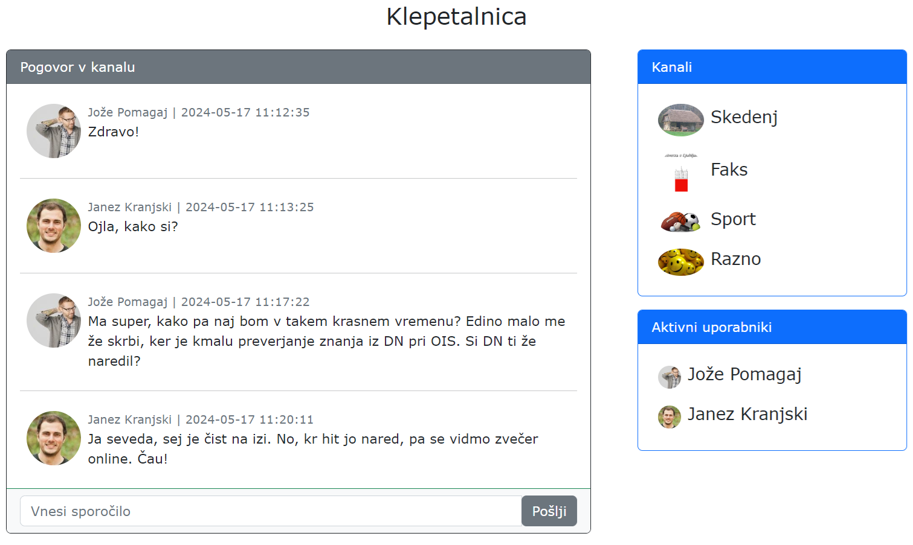

# **V11** Klepetalnica

Odgovore na vprašanja iz teh vaj lahko posredujete v okviru [ lekcije **V11**](https://ucilnica.fri.uni-lj.si/mod/quiz/view.php?id=55822) na spletni učilnici.

## Vzpostavitev okolja

Na voljo je odjemalska spletna aplikacija **Klepetalnica**, ki za podporo poglavitnih funkcionalnosti uporablja [ **Teaching API**](https://teaching.lavbic.net/api/docs/). V okviru vaj popravite in dopolnite obstoječo implementacijo v datoteki `js/skripta.js`, kot zahtevajo navodila. Med delom smiselno uveljavljajte spremembe v lokalnem in oddaljenem repozitoriju!

> **Opomba**: Za poenostavljeno reševanje naloge so v programski kodi v datoteki `js/skripta.js` na mestih kjer se zahtevajo odgovori podani nizi **`ODGOVOR`** kar posledično na spletni strani prikazuje napake na strani odjemalca. **Nize `ODGOVOR` nadomestite s pravilnimi odgovori oz. rešitvami.**

## Spletna storitev in odjemalec

Odjemalska aplikacija, ki jo boste izdelali v okviru teh vaj, se bo morala povezovati na spletno storitev **Klepetalnica**. Spletna storitev omogoča različne metode, ki so podrobno opisane v dokumentaciji spletne platforme [ **Teaching API**](https://teaching.lavbic.net/api/docs/) in omogoča tudi ročno preizkušanje storitev. Pri reševanju vseh nadaljnjih nalog si pomagajte s to dokumentacijo.

V vaši odjemalski aplikaciji vnesite svoje podatke za spremenljivko `uporabnik` v datoteki `js/skripta.js`, kjer za polje `id` uporabite vrednost med **0** in **95**.

`js/skripta.js`

~~~~ {.javascript}
let uporabnik = {id: 66, vzdevek: "Radovedni Matic"}; // TODO: vnesi svoje podatke
~~~~

Nato odprite spletno stran `index.html` in pojaviti bi se vam moralo okno, prikazano na naslednji sliki.

   
    <i>Uporabniški vmesnik spletne klepetalnice</i>

## Pridobivanje pogovorov

Implementirajte funkcijo za pridobivanje pogovorov v datoteki `js/skripta.js`, ki se po uspešni izvedbi samodejno pokliče vsakih 5 sekund. Uporabite enak stil prikazovanja sporočil, kot je že prikazan v datoteki `index.html`.

Lahko tudi pazite na obremenjenost povezave in ob osvežitvah prenašate le nova sporočila.

> **Namig**: Vse podrobnosti o delovanju funkcij spletne storitve najdete v dokumentaciji [ **Teaching API**](https://teaching.lavbic.net/api/docs/), kjer jih lahko tudi interaktivno testirate.

## Posodabljanje uporabnikov

Implementirajte funkcijo za posodabljanje uporabnikov v datoteki `js/skripta.js`, ki se po uspešni izvedbi samodejno pokliče vsakih 5 sekund. Uporabite enak stil prikazovanja sporočil, kot je že prikazan v datoteki `index.html`.

## Pošiljanje sporočila

Sedaj lahko v vašem odjemalcu le opazujete, kaj pišejo drugi uporabniki, zato implementirajte funkcijo za pošiljanje sporočil. Sporočilo naj se pošlje ob pritisku na gumb `Pošlji` oz. pritisku na tipko `ENTER` in po uspešni izvedbi naj se polje z vnesenim sporočilom izprazni. V primeru napake izpišite opozorilo (`alert()`) z vsebino opisa napake iz strežnika. Prav tako takoj posodobite sporočila v pogovoru in seznam uporabnikov.

## Menjava kanala

Implementirajte funkcionalnost za menjavo kanala. Pri tem v oknu s sporočili le izbrišite trenutne pogovore, uporabnike in kanal ter ustrezno nastavite globalni spremenljivki `trenutniKanal` in `idNaslednjegaSporocila`.

Bodite tudi pazljivi, da ob zamenjavi seznama sob funkcionalnost menjave sob še vedno deluje! Prav tako poskrbite, da se testna sporočila, ki so trenutno prikazana, izbrišejo in se prikažejo zgolj tista, ki jih pridobite iz strežnika.

> **Namig**: Razmislite, kje bi lahko prišlo do nenavadnega obnašanja vašega odjemalca.