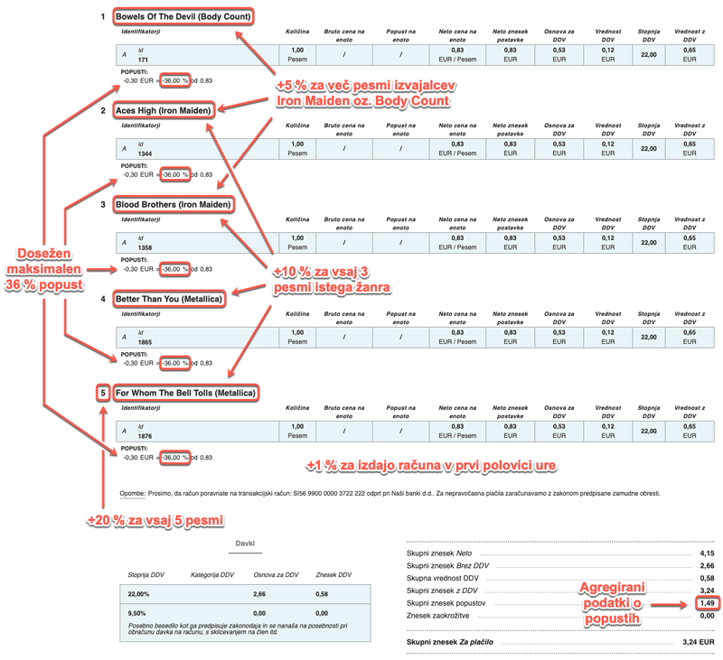
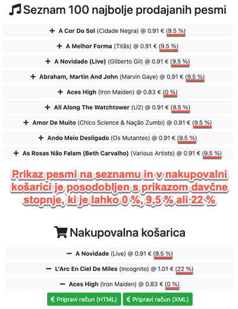
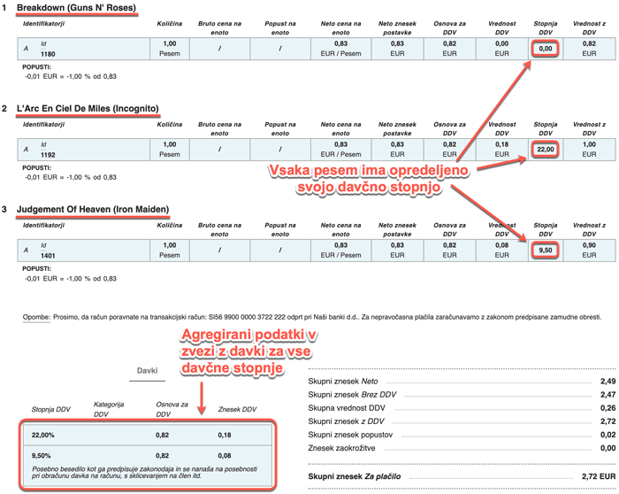
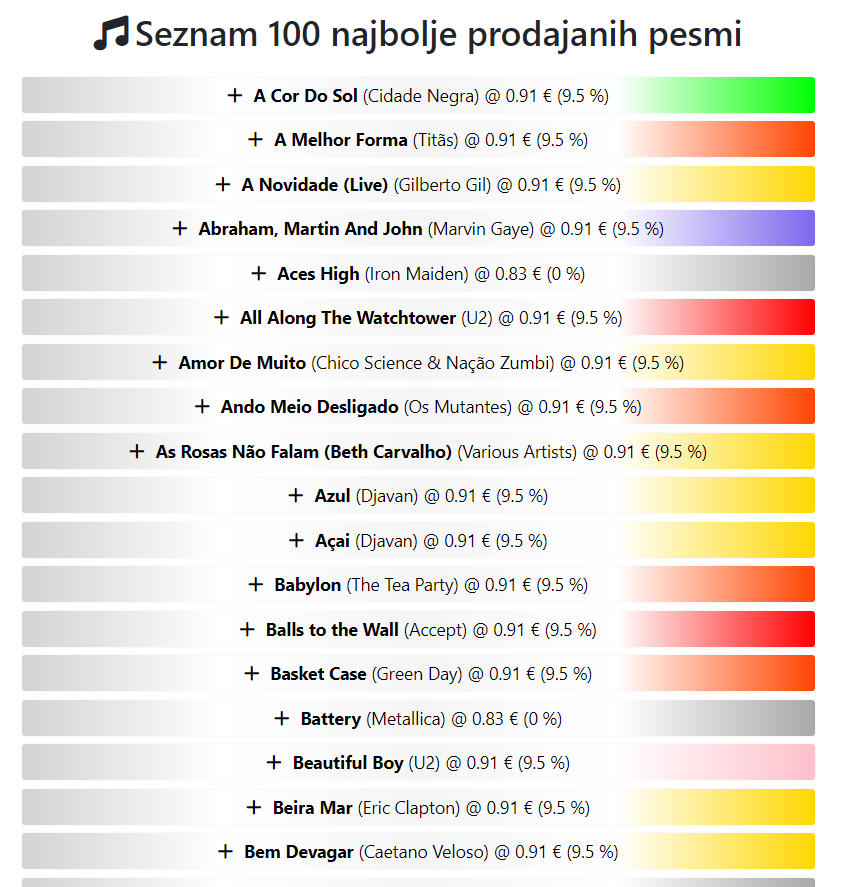

# **V6** Spletna trgovina e-pesmi

Za lažje razumevanje vaj si poglejte priprave na vaje iz predavanj [P6 → V6 Seja, košarica, XML in e-SLOG](https://teaching.lavbic.net/OIS/2023-2024/P6-V6.html#P6-V6), odgovore na vprašanja iz teh vaj lahko posredujete v okviru [lekcije V6](https://ucilnica.fri.uni-lj.si/mod/quiz/view.php?id=55310) na spletni učilnici.

## Vzpostavitev okolja

Na voljo je Node.js **spletna trgovina e-Pesmi**, predstavljena na predavanjih P6 &rarr; V6 [Seja, košarica, XML in e-SLOG](https://teaching.lavbic.net/OIS/2023-2024/P6-V6.html#P6-V6). Z uporabo funkcije _Fork_ ustvarite lastno kopijo repozitorija, v okviru katerega boste opravljali vaje, in si ga prenesite v svoje lokalno razvojno okolje. V okviru vaj popravite in dopolnite obstoječo implementacijo spletne trgovine, kot zahtevajo navodila. Med delom smiselno uveljavljajte spremembe v lokalnem in oddaljenem repozitoriju!

## Naloga

> **Opomba**: Za poenostavljeno reševanje naloge so v programski kodi na mestih kjer se zahtevajo odgovori podani nizi **`ODGOVOR`** kar posledično na spletni strani prikazuje napake na strani odjemalca ali strežnika. Pri nekaterih nalogah kjer je v obliki komentarja navedeno je potrebno odstraniti večvrstični komentar (niza `/*` in `*/` ali HTML komentar <!-- -->). **Nize `ODGOVOR` nadomestite s pravilnimi odgovori oz. rešitvami**.

### 1. Super količinski popusti

Trenutna implementacija spletne trgovine e-Pesmi ne predvideva dodatnih količinskih popustov, ki bi morda privabili nove stranke. Popravite implementacijo tako, da se pri pripravi e-Računa upoštevajo še spodnji popusti. Popusti se seštevajo in veljajo za vsako posamezno pesem v košarici.

* +20 % popust pri nakupu pet ali več pesmi poljubnih izvajalcev,
* +10 % popust pri nakupu treh ali več pesmi istega žanra ali žanrov,
* +5 % popust pri nakupu več pesmi izvajalcev _Iron Maiden_ ali _Body Count_,
* +1 % popust pri računu izdanem v prvi polovici ure (npr. med 13:00 in 13:30 itd.).

Naslednja slika prikazuje največji možen dosežen popust, ki znaša +36 %, kar smo dosegli z dodajanjem pesmi: _Bowels Of The Devil (Body Count)_, _Aces High (Iron Maiden)_, _Blood Brothers (Iron Maiden)_, _Better Than You (Metallica)_ in _For Whom The Bell Tolls (Metallica)_.

> **Opomba**: Račun je bil generiran v prvi polovici ure, zato je v tem primeru prisoten še +1 % popust.

   
    <i>Primer največjega možnega popusta</i>

> **Namigi**: Pri implementaciji bo potrebno pridobiti podatke o žanrih posameznih pesmi v košarici, kar boste implementirali v datoteki `eracun.js` (dopolniti je potrebno SQL poizvedbo, kjer podatke o žanrih najdete v tabeli `Genre`). Prav tako pa je treba dopolniti generiranje e-Računa, kjer se podprejo vsi zgoraj opisani scenariji popustov.

### 2. Spremenljiva davčna stopnja

Trenutna implementacija spletne trgovine e-Pesmi za vse pesmi predvideva davčno stopnjo 22 %. Popravite implementacijo tako, da bodo pesmi legendarnih izvajalcev **Queen**, **Led Zeppelin** in **Kiss** ter vse pesmi žanrov **Metal**, **Heavy Metal** in **Easy Listening** neobdavčene. Za ostale pesmi se predvideva davčna stopnja 9,5 %, kjer pa edino za pesmi izvajalcev **Justin Bieber** in **Incognito** ohranite davčno stopnjo 22 %. Pazite, da pri pripravi e-Računa ločeno izračunate osnove za posamezno davčno stopnjo (glej prvo naslednjo sliko). Popravite tudi izpis pesmi na spletni strani trgovine tako, da pri izračunu cene pesmi upoštevate tudi davčno stopnjo ter le-to izpišete kot `... @ 1.01 € (9.5 %)` (glej drugo naslednjo sliko).

   
    <i>Prikaz davčne stopnje na seznamu pesmi in v nakupovalni košarici</i>

   
    <i>Primer prikaza posameznih davčnih stopenj na e-Računu</i>

> **Namigi**: Pri implementaciji bo potrebnih več manjših sprememb. Najprej je priporočljivo uvesti **novo funkcijo za izračun davčne stopnje** v `eracun.js`, ki na podlagi prejetih parametrov (izvajalec in žanr) vrne ustrezno davčno stopnjo, kot to opredeljujejo navodila. Ker je pri izračunu davčne stopnje potreben tudi **podatek o žanru pesmi**, ga moramo **pridobiti iz podatkovne baze** pri prikazu seznama vseh pesmi (storitev `/` v `eracun.js`) in pri prikazu podrobnosti pesmi v košarici (metoda `pesmiIzKosarice` v `eracun.js`). Potrebno bo posodobiti obstoječo SQL poizvedbo, in sicer podobno, kot ste to izvedli že pri prejšnji nalogi. Poleg tega pa je potrebno vsaki pesmi posebej dodati podatek o davčni stopnji s pomočjo prej omenjene funkcije za izračun davčne stopnje. To je potrebno izvesti na podatkih takoj, ko jih pridobimo iz podatkovne baze in še preden jih pošljemo v vizualizacijo pogleda `seznam`. Pri **prikazu seznama pesmi** (datoteka `views/seznam.hbs`) je potrebno poskrbeti za **dodajanje** podatka o **davčni stopnji**, kar zapišemo v oklepajih in je podrobneje opredeljeno v navodilih. Posodobiti je potrebno tudi prikaz v metodi `premakniPesemIzSeznamaVKosarico`, kjer dodamo nov parameter davčne stopnje in poskrbimo za ustrezen klic omenjene metode. Nenazadnje pa so popravki potrebni tudi v `views/eslog.hbs`, ki skrbi za prikaz e-Računa. Ključna funkcionalnost, ki manjka, je upoštevanje različnih davčnih stopenj pri izračunu osnove za posamezno davčno stopnjo (glej zgornjo sliko). Pripravite si lahko objekt s tremi ključnimi vrednostmi (0, 9.5 in 22) ter v zanki ustrezno nastavite in jih nato prikažete v zbirni tabeli na računu.

### 3. Osvežitev prikaza na seznamu pesmi

Prikaz seznama 100 najbolj prodajanih pesmi želite posodobiti, da bo iskanje pesmi na podlagi žanrov bolj pregledno. Zato ste se odločili, da najprej vprašate spletno storitev _ChatGPT_ naj vam predlaga barve glede na glasbene za kar pripravite namensko funkcijo `pridobiBarvoZanra` v datoteki `eracun.js`. Za osvežen prikaz seznama pesmi boste uporabili gradientno prikazovanje **[CSS Gradients](https://www.w3schools.com/css/css3_gradients.asp)** in sicer **prehod barv od leve proti desni** pri čemer barve prehajajo od svetlo sive &rarr; bele &rarr; dimne bele &rarr; bele &rarr; barve žanra, kot prikazuje naslednja slika.

   
    <i>Primer osvežitve prikaza seznama 100 najbolj prodajanih pesmi</i>

> **Namigi**: Pri določitvi podatka elementa pesmi si pomagajte z vnaprej pripravljeno Handlebars predlogo z že pripravljeno referenco v datoteki `views/seznam.hbs`.
