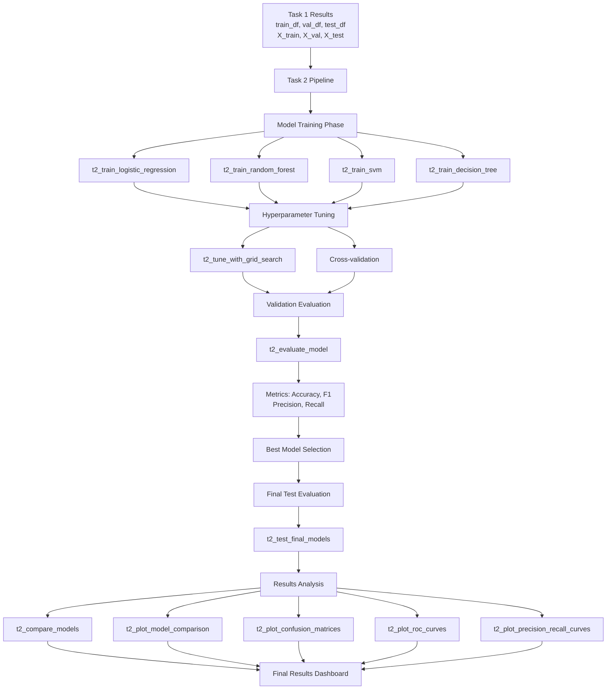

# Task 2 Implementation Plan: Basic Machine Learning for Contradiction Detection

## Overview
Implement traditional machine learning classifiers to detect contradictions in legal text pairs from the English dataset. This builds upon Task 1's data preparation and uses the preprocessed features (TF-IDF and Bag-of-Words) to train and evaluate multiple classifiers.

## Requirements Summary

Based on the assignment document (lines 34-45), Task 2 requires:
- Train and evaluate several traditional ML classifiers
- Suggested models: Logistic Regression, Decision Trees, Random Forests, SVM
- Use text representations: TF-IDF and Bag-of-Words (already created in Task 1)
- Apply hyperparameter tuning and cross-validation
- Evaluate with appropriate metrics: accuracy, F1, precision, recall
- Use test set only for final evaluation

## Current State Analysis

### Available from Task 1
- ✅ Data loading: [`load_jsonl()`](seminar2.py:18) and [`load_english_dataset()`](seminar2.py:26)
- ✅ Binary transformation: [`t1_transform_to_binary()`](seminar2.py:33)
- ✅ Text pair creation: [`t1_combine_text_pairs()`](seminar2.py:43)
- ✅ Data splitting: [`t1_split_data()`](seminar2.py:143) - groups by doc_id to prevent leakage
- ✅ TF-IDF features: [`t1_create_tfidf_features()`](seminar2.py:168)
- ✅ BoW features: [`t1_create_bow_features()`](seminar2.py:187)
- ✅ Pipeline: [`t1_run_full_pipeline()`](seminar2.py:375)

### Data Characteristics
- Format: premise-hypothesis pairs from legal documents (NDA agreements)
- Original labels: Entailment, Contradiction, NotMentioned
- Binary task: Contradiction (1) vs Non-Contradiction (0)
- Text representation: "premise [SEP] hypothesis"
- Split strategy: Group by doc_id (prevents data leakage)

## Implementation Architecture



## Code Organization Strategy

### Naming Convention
- **Task-2 specific functions**: Prefix with `t2_` (e.g., `t2_train_logistic_regression`)
- **Generic utility functions**: No prefix, can be shared across tasks
- **Consistent with Task 1**: Follow existing code style and patterns

### Code Reuse from Task 1
1. **Direct reuse** (no modification needed):
   - Data loading utilities
   - Preprocessing functions
   - Vectorization functions
   - Data from `t1_run_full_pipeline()` results dictionary

2. **Adaptation** (use similar patterns):
   - Plotting style and color schemes
   - Display functions with HTML headers
   - Statistical summary table creation

## Detailed Implementation Plan

### Phase 1: Core Model Training Functions

#### 1.1 Logistic Regression Trainer
**Function**: `t2_train_logistic_regression(X_train, y_train, random_state=42)`

**Purpose**: Train Logistic Regression baseline model

**Parameters**:
- `X_train`: Training features (sparse matrix from TF-IDF or BoW)
- `y_train`: Training labels (binary)
- `random_state`: Random seed for reproducibility

**Returns**: Trained LogisticRegression model

**Implementation details**:
- Use `sklearn.linear_model.LogisticRegression`
- Default parameters: `max_iter=1000`, `random_state=42`
- Consider class imbalance with `class_weight='balanced'`

#### 1.2 Random Forest Trainer
**Function**: `t2_train_random_forest(X_train, y_train, n_estimators=100, random_state=42)`

**Purpose**: Train Random Forest ensemble classifier

**Parameters**:
- `X_train`: Training features
- `y_train`: Training labels
- `n_estimators`: Number of trees
- `random_state`: Random seed

**Returns**: Trained RandomForestClassifier model

**Implementation details**:
- Use `sklearn.ensemble.RandomForestClassifier`
- Default parameters: `n_estimators=100`, `max_depth=None`
- Consider `class_weight='balanced'`

#### 1.3 SVM Trainer
**Function**: `t2_train_svm(X_train, y_train, kernel='rbf', random_state=42)`

**Purpose**: Train Support Vector Machine classifier

**Parameters**:
- `X_train`: Training features
- `y_train`: Training labels
- `kernel`: Kernel type ('linear', 'rbf', 'poly')
- `random_state`: Random seed

**Returns**: Trained SVC model

**Implementation details**:
- Use `sklearn.svm.SVC` with `probability=True` for ROC curves
- For large datasets, consider `LinearSVC` for efficiency
- May need different kernels for different feature types

#### 1.4 Decision Tree Trainer
**Function**: `t2_train_decision_tree(X_train, y_train, max_depth=None, random_state=42)`

**Purpose**: Train single Decision Tree classifier

**Parameters**:
- `X_train`: Training features
- `y_train`: Training labels
- `max_depth`: Maximum tree depth (None for unlimited)
- `random_state`: Random seed

**Returns**: Trained DecisionTreeClassifier model

**Implementation details**:
- Use `sklearn.tree.DecisionTreeClassifier`
- Include for comparison with Random Forest
- Good baseline to show ensemble improvement

### Phase 2: Hyperparameter Tuning Functions

#### 2.1 Grid Search Tuner
**Function**: `t2_tune_with_grid_search(model_type, X_train, y_train, X_val, y_val, param_grid, cv=5)`

**Purpose**: Perform grid search with cross-validation for hyperparameter optimization

**Parameters**:
- `model_type`: String identifier ('lr', 'rf', 'svm', 'dt')
- `X_train`: Training features
- `y_train`: Training labels
- `X_val`: Validation features
- `y_val`: Validation labels
- `param_grid`: Dictionary of parameters to search
- `cv`: Number of cross-validation folds

**Returns**: Tuple of (best_model, best_params, cv_results)

**Implementation details**:
- Use `sklearn.model_selection.GridSearchCV`
- Scoring metric: 'f1' (appropriate for imbalanced data)
- Use validation set for final model selection
- Return comprehensive results for analysis

#### 2.2 Logistic Regression Hyperparameter Tuning
**Function**: `t2_tune_logistic_regression(X_train, y_train, X_val, y_val, cv=5)`

**Purpose**: Optimize LR hyperparameters

**Parameter grid**:
```python
{
    'C': [0.001, 0.01, 0.1, 1, 10, 100],
    'penalty': ['l1', 'l2'],
    'solver': ['liblinear', 'saga'],
    'class_weight': ['balanced', None]
}
```

#### 2.3 Random Forest Hyperparameter Tuning
**Function**: `t2_tune_random_forest(X_train, y_train, X_val, y_val, cv=5)`

**Purpose**: Optimize RF hyperparameters

**Parameter grid**:
```python
{
    'n_estimators': [50, 100, 200],
    'max_depth': [10, 20, 30, None],
    'min_samples_split': [2, 5, 10],
    'min_samples_leaf': [1, 2, 4],
    'class_weight': ['balanced', 'balanced_subsample', None]
}
```

#### 2.4 SVM Hyperparameter Tuning
**Function**: `t2_tune_svm(X_train, y_train, X_val, y_val, cv=5)`

**Purpose**: Optimize SVM hyperparameters

**Parameter grid**:
```python
{
    'C': [0.1, 1, 10, 100],
    'kernel': ['linear', 'rbf'],
    'gamma': ['scale', 'auto', 0.001, 0.01],
    'class_weight': ['balanced', None]
}
```

### Phase 3: Model Evaluation Functions

#### 3.1 Model Evaluator
**Function**: `t2_evaluate_model(model, X, y, dataset_name='validation')`

**Purpose**: Compute comprehensive evaluation metrics

**Parameters**:
- `model`: Trained classifier
- `X`: Feature matrix
- `y`: True labels
- `dataset_name`: Dataset identifier for reporting

**Returns**: Dictionary with metrics
```python
{
    'accuracy': float,
    'precision': float,
    'recall': float,
    'f1': float,
    'confusion_matrix': array,
    'classification_report': dict,
    'roc_auc': float (if probability available),
    'predictions': array,
    'probabilities': array (if available)
}
```

**Implementation details**:
- Use `sklearn.metrics`: accuracy_score, precision_score, recall_score, f1_score
- Use `classification_report` for detailed per-class metrics
- Include confusion matrix
- Calculate ROC-AUC when probability estimates available

#### 3.2 Confusion Matrix Creator
**Function**: `t2_create_confusion_matrix_df(cm, labels=['Non-Contradiction', 'Contradiction'])`

**Purpose**: Convert confusion matrix to formatted DataFrame

**Parameters**:
- `cm`: Confusion matrix from sklearn
- `labels`: Class labels

**Returns**: Styled pandas DataFrame with percentages and counts

#### 3.3 Classification Report Creator
**Function**: `t2_create_classification_report_df(report_dict)`

**Purpose**: Convert sklearn classification report to formatted DataFrame

**Parameters**:
- `report_dict`: Dictionary from classification_report with output_dict=True

**Returns**: Formatted pandas DataFrame

### Phase 4: Visualization Functions

#### 4.1 Confusion Matrix Plotter
**Function**: `t2_plot_confusion_matrix(cm, model_name, normalize=True)`

**Purpose**: Visualize confusion matrix as heatmap

**Parameters**:
- `cm`: Confusion matrix
- `model_name`: Name for plot title
- `normalize`: Whether to show percentages

**Returns**: matplotlib Figure

**Visualization details**:
- Use seaborn heatmap
- Show both counts and percentages
- Color scheme: consistent with Task 1 (#3498db, #e74c3c)
- Annotations with clear font

#### 4.2 Model Comparison Plotter
**Function**: `t2_plot_model_comparison(results_df, metric='f1')`

**Purpose**: Compare models across different metrics

**Parameters**:
- `results_df`: DataFrame with model results
- `metric`: Metric to highlight ('f1', 'accuracy', etc.)

**Returns**: matplotlib Figure with multiple subplots

**Visualization details**:
- Bar charts for each metric
- Group by model and feature type (TF-IDF vs BoW)
- Color coding by model type
- Include value labels on bars

#### 4.3 ROC Curves Plotter
**Function**: `t2_plot_roc_curves(models_dict, X_test, y_test, feature_type='tfidf')`

**Purpose**: Plot ROC curves for all models on same axes

**Parameters**:
- `models_dict`: Dictionary of {model_name: model}
- `X_test`: Test features
- `y_test`: Test labels
- `feature_type`: Feature type identifier

**Returns**: matplotlib Figure

**Visualization details**:
- All models on same plot
- Include AUC scores in legend
- Diagonal reference line
- Different colors/styles per model

#### 4.4 Precision-Recall Curves Plotter
**Function**: `t2_plot_precision_recall_curves(models_dict, X_test, y_test, feature_type='tfidf')`

**Purpose**: Plot PR curves for all models

**Parameters**:
- `models_dict`: Dictionary of {model_name: model}
- `X_test`: Test features
- `y_test`: Test labels
- `feature_type`: Feature type identifier

**Returns**: matplotlib Figure

**Visualization details**:
- All models on same plot
- Include average precision in legend
- Baseline reference line
- Different colors/styles per model

#### 4.5 Feature Importance Plotter
**Function**: `t2_plot_feature_importance(model, vectorizer, model_name, top_n=20)`

**Purpose**: Visualize top important features for tree-based models and LR

**Parameters**:
- `model`: Trained model
- `vectorizer`: Vectorizer used (for feature names)
- `model_name`: Model name for title
- `top_n`: Number of top features to show

**Returns**: matplotlib Figure

**Conditions**:
- Applicable to: Logistic Regression (coefficients), Random Forest, Decision Tree
- Not applicable to: SVM with RBF kernel

### Phase 5: Results Aggregation Functions

#### 5.1 Model Comparison Aggregator
**Function**: `t2_compare_models(model_results)`

**Purpose**: Aggregate results from all models into comparison tables

**Parameters**:
- `model_results`: Dictionary of evaluation results per model

**Returns**: Dictionary with:
```python
{
    'summary_df': DataFrame,  # All models, all metrics
    'best_models': dict,      # Best model per metric
    'feature_comparison': DataFrame  # TF-IDF vs BoW comparison
}
```

#### 5.2 Cross-Validation Results Aggregator
**Function**: `t2_aggregate_cv_results(cv_results_dict)`

**Purpose**: Create summary of cross-validation results

**Parameters**:
- `cv_results_dict`: Dictionary of GridSearchCV results per model

**Returns**: DataFrame with CV scores and best parameters

### Phase 6: Main Pipeline Function

#### 6.1 Complete Task 2 Pipeline
**Function**: `t2_run_full_pipeline(task1_results, tune_hyperparams=True, cv_folds=5)`

**Purpose**: Execute complete Task 2 workflow

**Parameters**:
- `task1_results`: Dictionary returned from `t1_run_full_pipeline()`
- `tune_hyperparams`: Whether to perform hyperparameter tuning
- `cv_folds`: Number of cross-validation folds

**Returns**: Dictionary with:
```python
{
    'models_tfidf': {
        'logistic_regression': model,
        'random_forest': model,
        'svm': model,
        'decision_tree': model
    },
    'models_bow': {
        'logistic_regression': model,
        'random_forest': model,
        'svm': model,
        'decision_tree': model
    },
    'best_params_tfidf': dict,
    'best_params_bow': dict,
    'val_results_tfidf': dict,
    'val_results_bow': dict,
    'test_results_tfidf': dict,
    'test_results_bow': dict,
    'comparison_tables': dict,
    'cv_results': dict
}
```

**Workflow**:
1. Extract data from Task 1 results
2. For each feature type (TF-IDF and BoW):
   a. Train baseline models
   b. Perform hyperparameter tuning (if enabled)
   c. Evaluate on validation set
   d. Select best hyperparameters
3. Train final models with best parameters
4. Evaluate on test set (final evaluation)
5. Generate comparison tables and visualizations
6. Display results with HTML formatting

## Implementation Details

### Required Imports
```python
from sklearn.linear_model import LogisticRegression
from sklearn.ensemble import RandomForestClassifier
from sklearn.tree import DecisionTreeClassifier
from sklearn.svm import SVC, LinearSVC
from sklearn.model_selection import GridSearchCV, cross_val_score
from sklearn.metrics import (
    accuracy_score, precision_score, recall_score, f1_score,
    confusion_matrix, classification_report, roc_curve, auc,
    precision_recall_curve, average_precision_score,
    roc_auc_score
)
```

### Evaluation Metrics Strategy

**Primary Metrics**:
- **F1 Score**: Primary metric for model selection (handles class imbalance)
- **Precision**: Important for legal applications (minimize false positives)
- **Recall**: Ensure we catch actual contradictions
- **Accuracy**: Overall performance indicator

**Secondary Metrics**:
- **ROC-AUC**: Threshold-independent performance
- **Average Precision**: PR curve summary
- **Confusion Matrix**: Detailed error analysis

### Hyperparameter Tuning Strategy

**Approach**: GridSearchCV with cross-validation
- **CV Strategy**: StratifiedKFold (preserves class distribution)
- **Scoring**: 'f1' for primary optimization
- **Refit**: True (train on full train set with best params)
- **n_jobs**: -1 (use all CPU cores for speed)
- **verbose**: 1 (show progress)

**Search Space Considerations**:
- Start with broad range, refine if needed
- Balance between search time and thoroughness
- Consider computational constraints for large param grids

### Data Flow

**Input from Task 1**:
```python
task1_results = t1_run_full_pipeline(dataset_choice='english')
# Contains: train_df, val_df, test_df
#           X_train_tfidf, X_val_tfidf, X_test_tfidf
#           X_train_bow, X_val_bow, X_test_bow
#           y_train, y_val, y_test
#           vectorizers, etc.
```

**Processing Flow**:
1. **TF-IDF Models**:
   - Train all 4 models on X_train_tfidf
   - Tune on (X_train_tfidf, X_val_tfidf)
   - Final evaluation on X_test_tfidf

2. **BoW Models**:
   - Train all 4 models on X_train_bow
   - Tune on (X_train_bow, X_val_bow)
   - Final evaluation on X_test_bow

3. **Comparison**:
   - Compare TF-IDF vs BoW for each model
   - Identify best model overall
   - Analyze which features work best

## Function Implementation Order

### Step 1: Basic Infrastructure (no tuning)
1. `t2_train_logistic_regression()`
2. `t2_train_random_forest()`
3. `t2_train_svm()`
4. `t2_train_decision_tree()`
5. `t2_evaluate_model()`

### Step 2: Visualization
6. `t2_create_confusion_matrix_df()`
7. `t2_plot_confusion_matrix()`
8. `t2_create_classification_report_df()`

### Step 3: Hyperparameter Tuning
9. `t2_tune_with_grid_search()`
10. `t2_tune_logistic_regression()`
11. `t2_tune_random_forest()`
12. `t2_tune_svm()`
13. `t2_aggregate_cv_results()`

### Step 4: Advanced Visualization
14. `t2_plot_model_comparison()`
15. `t2_plot_roc_curves()`
16. `t2_plot_precision_recall_curves()`
17. `t2_plot_feature_importance()`

### Step 5: Results Aggregation
18. `t2_compare_models()`
19. `t2_create_results_summary()`

### Step 6: Main Pipeline
20. `t2_run_full_pipeline()`

## Expected Results Tables

### Model Performance Summary
| Model | Feature Type | Accuracy | Precision | Recall | F1 | ROC-AUC |
|-------|-------------|----------|-----------|--------|----|---------|
| Logistic Regression | TF-IDF | X.XX | X.XX | X.XX | X.XX | X.XX |
| Logistic Regression | BoW | X.XX | X.XX | X.XX | X.XX | X.XX |
| Random Forest | TF-IDF | X.XX | X.XX | X.XX | X.XX | X.XX |
| Random Forest | BoW | X.XX | X.XX | X.XX | X.XX | X.XX |
| SVM | TF-IDF | X.XX | X.XX | X.XX | X.XX | X.XX |
| SVM | BoW | X.XX | X.XX | X.XX | X.XX | X.XX |
| Decision Tree | TF-IDF | X.XX | X.XX | X.XX | X.XX | X.XX |
| Decision Tree | BoW | X.XX | X.XX | X.XX | X.XX | X.XX |

### Best Hyperparameters Table
| Model | Feature Type | Best Parameters | Best CV F1 |
|-------|-------------|-----------------|------------|
| Logistic Regression | TF-IDF | {...} | X.XX |
| Random Forest | TF-IDF | {...} | X.XX |
| ... | ... | ... | ... |

## Visualization Outputs

### Plot 1: Confusion Matrices (2x4 grid)
- 8 subplots: 4 models × 2 feature types
- Heatmap format with annotations
- Normalized percentages

### Plot 2: Model Comparison Bar Charts
- 4 subplots: Accuracy, Precision, Recall, F1
- Grouped bars by model
- Color-coded by feature type

### Plot 3: ROC Curves
- 2 subplots: TF-IDF (left), BoW (right)
- All models on each subplot
- AUC scores in legend

### Plot 4: Precision-Recall Curves
- 2 subplots: TF-IDF (left), BoW (right)
- All models on each subplot
- Average Precision in legend

### Plot 5: Feature Importance (if applicable)
- Top 20 features for each model
- Horizontal bar charts
- Positive and negative coefficients (for LR)

## Code Quality Standards

### Consistency with Task 1
- **Function naming**: Follow `t2_` prefix convention
- **Docstrings**: Match Task 1 style (brief description of purpose)
- **Parameter naming**: Consistent with existing code
- **Return types**: Use dictionaries and DataFrames like Task 1
- **Visualization style**: Use same color palette and formatting

### Error Handling
- Check for empty/invalid inputs
- Handle cases where models don't support probabilities
- Graceful degradation if certain visualizations fail

### Documentation
- Clear docstrings for each function
- Inline comments for complex logic
- Parameter descriptions
- Return value specifications

## Integration Points

### Connection to Task 1
```python
# Example usage:
task1_results = t1_run_full_pipeline(dataset_choice='english')
task2_results = t2_run_full_pipeline(
    task1_results=task1_results,
    tune_hyperparams=True,
    cv_folds=5
)
```

### Connection to Future Tasks
Task 2 results will provide:
- Baseline performance for comparison with transformers (Task 3)
- Insights into which features work best
- Understanding of class imbalance handling
- Model zoo for potential ensemble methods

## Testing Strategy

### Validation During Development
1. **Smoke test**: Train simple LR model, verify it runs
2. **Shape test**: Verify predictions match expected shape
3. **Metric test**: Ensure metrics in valid ranges [0, 1]
4. **Visualization test**: Ensure plots render without errors

### Expected Behavior
- Models should achieve better than random performance (>50% accuracy)
- Ensemble models (RF) likely to outperform single models (DT)
- TF-IDF may outperform BoW due to n-grams and TF-IDF weighting
- Class imbalance handling should improve recall on minority class

## Additional Considerations

### Class Imbalance
From Task 1 analysis, contradiction rate is likely low (~10-30%). Strategy:
- Use `class_weight='balanced'` in models
- Focus on F1 score rather than accuracy
- Monitor precision-recall tradeoff
- Consider SMOTE if needed (optional enhancement)

### Computational Efficiency
- **SVM**: Most expensive, consider LinearSVC for large data
- **Random Forest**: Moderate cost, use n_jobs=-1
- **Logistic Regression**: Fast, good baseline
- **Decision Tree**: Fast, good for comparison

### Reproducibility
- Set `random_state=42` consistently
- Document all random seeds
- Save model configurations
- Version control parameter grids

## Deliverables Checklist

- [ ] 4 trained classifiers per feature type (8 total)
- [ ] Hyperparameter tuning results
- [ ] Validation set evaluation results
- [ ] Test set evaluation results (final)
- [ ] Confusion matrices for all models
- [ ] Classification reports for all models
- [ ] Model comparison tables
- [ ] ROC curves
- [ ] Precision-Recall curves
- [ ] Feature importance visualizations
- [ ] Comprehensive results summary

## Success Criteria

1. **Functional**: All models train and predict successfully
2. **Performance**: Models exceed baseline (random classifier)
3. **Evaluation**: Comprehensive metrics on test set
4. **Visualization**: Clear, publication-quality plots
5. **Integration**: Seamless integration with Task 1 code
6. **Documentation**: Well-documented, maintainable code
7. **Reproducibility**: Results can be reproduced with same seed

## Risk Mitigation

### Potential Issues and Solutions

**Issue 1**: SVM too slow on large dataset
- **Solution**: Use LinearSVC or subsample for tuning

**Issue 2**: Memory issues with large parameter grids
- **Solution**: Use RandomizedSearchCV instead of GridSearchCV

**Issue 3**: Poor performance on minority class
- **Solution**: Adjust class weights, consider threshold tuning

**Issue 4**: Overfitting in Decision Tree/Random Forest
- **Solution**: Tune max_depth, min_samples_split/leaf

## Next Steps

After implementation:
1. Run complete pipeline on English dataset
2. Analyze results and identify best performing models
3. Document findings for Task 5 (report)
4. Use insights to inform Task 3 (transformer models)
5. Consider feature engineering improvements if needed

## Estimated Function Count

- **Training functions**: 4
- **Tuning functions**: 4
- **Evaluation functions**: 3
- **Visualization functions**: 5
- **Aggregation functions**: 2
- **Pipeline function**: 1
- **Utility functions**: 2-3

**Total**: ~21-22 new functions

## File Structure

All functions will be added to [`seminar2.py`](seminar2.py) after the existing Task 1 functions, maintaining the current structure:

```python
# Existing imports
# Task 1 functions (lines 1-453)
# --- Task 2 functions start here ---
# Training functions
# Tuning functions
# Evaluation functions
# Visualization functions
# Aggregation functions
# Pipeline function
# Main execution (if __name__ == "__main__")
```
