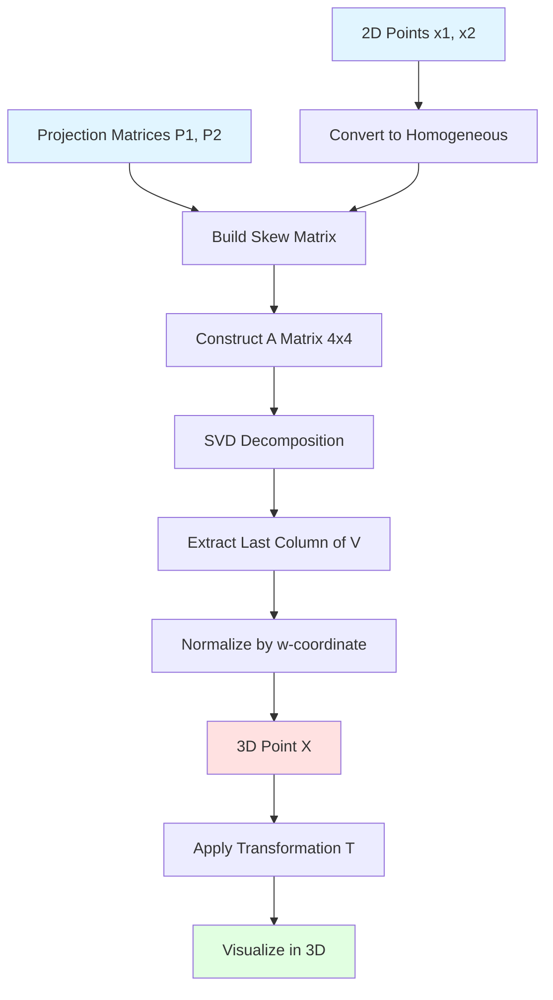

# Exercise 3a Implementation Plan

## Overview
Implement triangulation to reconstruct 3D points from 2D correspondences in multiple camera views, given the camera projection matrices.

## Background

### Triangulation Theory
Given:
- 2D point correspondence: x₁ (in image 1) and x₂ (in image 2) in homogeneous coordinates
- Projection matrices: P₁ (3×4) and P₂ (3×4)

Find: 3D point X in homogeneous coordinates (4D)

### Mathematical Formulation

The projection equations are:
```
λ₁ x₁ = P₁ X    (equation 10)
λ₂ x₂ = P₂ X    (equation 11)
```

where λ₁, λ₂ ∈ ℝ are unknown scale factors.

Since the cross product of parallel vectors is 0:
```
x₁ × (P₁ X) = 0    (equation 12)
x₂ × (P₂ X) = 0    (equation 13)
```

### Skew-Symmetric Matrix (Equation 14)
To eliminate the cross product, we use the skew-symmetric form:
```
a × b = [a×] b = [ 0   -aᵢ   aᵧ ]
                 [ aᵢ   0   -aₓ ] b
                 [-aᵧ   aₓ   0  ]
```

For a point x = [u, v, 1]ᵀ:
```
[x×] = [ 0  -1   v ]
       [ 1   0  -u ]
       [-v   u   0 ]
```

### Linear System Construction
From equations 12 and 13:
```
[x₁×] P₁ X = 0    (3 equations, 2 independent)
[x₂×] P₂ X = 0    (3 equations, 2 independent)
```

We construct matrix A (4×4) using the first two rows from each:
```
A = [ (row 0 of [x₁×] P₁) ]
    [ (row 1 of [x₁×] P₁) ]
    [ (row 0 of [x₂×] P₂) ]
    [ (row 1 of [x₂×] P₂) ]
```

Then solve: A X = 0

### Solution via SVD
- Decompose: A = U D Vᵀ
- Solution: X = last column of V (eigenvector with smallest eigenvalue)
- Normalize: X = X / X[3] to convert from homogeneous to 3D coordinates

## Implementation Tasks

### Task 1: Implement Skew-Symmetric Matrix Helper

Create a helper function to build the skew-symmetric matrix:

```python
def skew_symmetric(x):
    """
    Create skew-symmetric matrix from a 3D vector.

    Args:
        x: 3D vector [u, v, w] in homogeneous coordinates

    Returns:
        3x3 skew-symmetric matrix
    """
    return np.array([
        [0,    -x[2],  x[1]],
        [x[2],  0,    -x[0]],
        [-x[1], x[0],  0   ]
    ])
```

### Task 2: Implement Triangulate Function

**Function Signature:**
```python
def triangulate(pts1, pts2, P1, P2):
    """
    Triangulate 3D points from 2D correspondences and projection matrices.

    Args:
        pts1: Nx2 array of points in image 1 (column, row)
        pts2: Nx2 array of points in image 2 (column, row)
        P1: 3x4 projection matrix for camera 1
        P2: 3x4 projection matrix for camera 2

    Returns:
        points_3d: Nx3 array of triangulated 3D points
    """
```

**Algorithm for each point pair:**
1. Convert 2D points to homogeneous coordinates
2. Build skew-symmetric matrices [x₁×] and [x₂×]
3. Compute [x₁×] P₁ and [x₂×] P₂
4. Construct matrix A from first 2 rows of each product
5. Solve A X = 0 using SVD
6. Normalize X to 3D by dividing by w-coordinate
7. Store the 3D point

### Task 3: Load Data Files

**Projection Matrices:**
According to the file listing, projection matrices are in `data/house/3D/` with `.P` extension:
- `house.007.P` for image 007
- `house.008.P` for image 008

```python
P1 = np.loadtxt('data/house/3D/house.007.P')
P2 = np.loadtxt('data/house/3D/house.008.P')
```

**Matching Points:**
Reuse the matching points from exercise 2b/2c:
```python
pts1_all = np.loadtxt('data/house/2D/house.007.corners')
pts2_all = np.loadtxt('data/house/2D/house.008.corners')
matches = read_matches('data/house/2D/house.nview-corners', 7, 8)
pts1 = pts1_all[matches[:, 0]]
pts2 = pts2_all[matches[:, 1]]
```

### Task 4: 3D Visualization

**Requirements:**
- Use matplotlib 3D plotting
- Make it interactive (can rotate)
- Color-code corresponding points
- Label points with indices
- Apply coordinate transformation for better interpretation

**Coordinate Transformation (Equation 15):**
```python
T = np.array([
    [-1,  0,  0],
    [ 0,  0, -1],
    [ 0,  1,  0]
])

# Transform each 3D point
pts_3d_transformed = (T @ pts_3d.T).T
```

**Implementation:**
```python
from mpl_toolkits.mplot3d import Axes3D

fig = plt.figure(figsize=(15, 10))

# Create 2D image plots
ax1 = fig.add_subplot(1, 3, 1)
ax2 = fig.add_subplot(1, 3, 2)
ax3 = fig.add_subplot(1, 3, 3, projection='3d')

# Plot images with points
ax1.imshow(img1_rgb)
ax1.set_title('Image 007')
ax1.axis('off')

ax2.imshow(img2_rgb)
ax2.set_title('Image 008')
ax2.axis('off')

# Plot 3D points
for i in range(len(pts1)):
    color = plt.cm.rainbow(i / len(pts1))

    # Plot corresponding points in images
    ax1.plot(pts1[i, 0], pts1[i, 1], 'o', color=color, markersize=10)
    ax2.plot(pts2[i, 0], pts2[i, 1], 'o', color=color, markersize=10)

    # Plot 3D point
    ax3.scatter(pts_3d_transformed[i, 0],
                pts_3d_transformed[i, 1],
                pts_3d_transformed[i, 2],
                c=[color], s=100)

    # Add label
    ax3.text(pts_3d_transformed[i, 0],
             pts_3d_transformed[i, 1],
             pts_3d_transformed[i, 2],
             str(i), fontsize=8)

ax3.set_xlabel('X')
ax3.set_ylabel('Y')
ax3.set_zlabel('Z')
ax3.set_title('Triangulated 3D Points')

plt.tight_layout()
plt.show()
```

### Task 5: Create exercise3a() Function

**Structure:**
```python
def exercise3a():
    print("\nExercise 3a: Triangulation")
    print("=" * 60)

    # Load images
    img1 = cv2.imread('data/house/images/house.007.png')
    img2 = cv2.imread('data/house/images/house.008.png')
    img1_rgb = cv2.cvtColor(img1, cv2.COLOR_BGR2RGB)
    img2_rgb = cv2.cvtColor(img2, cv2.COLOR_BGR2RGB)

    # Load projection matrices
    P1 = np.loadtxt('data/house/3D/house.007.P')
    P2 = np.loadtxt('data/house/3D/house.008.P')
    print(f"Loaded projection matrices: {P1.shape}, {P2.shape}")

    # Load matching points
    pts1_all = np.loadtxt('data/house/2D/house.007.corners')
    pts2_all = np.loadtxt('data/house/2D/house.008.corners')
    matches = read_matches('data/house/2D/house.nview-corners', 7, 8)
    pts1 = pts1_all[matches[:, 0]]
    pts2 = pts2_all[matches[:, 1]]
    print(f"Loaded {len(matches)} matching point pairs")

    # Triangulate 3D points
    pts_3d = triangulate(pts1, pts2, P1, P2)
    print(f"Triangulated {len(pts_3d)} 3D points")

    # Apply coordinate transformation
    T = np.array([[-1, 0, 0], [0, 0, -1], [0, 1, 0]])
    pts_3d_transformed = (T @ pts_3d.T).T

    # Visualize
    # ... (as described above)

    print("=" * 60)
```

### Task 6: Update main() Function

Add call to exercise3a():
```python
def main():
    # Exercise 1
    exercise1b()

    # Exercise 2
    exercise2b()
    exercise2c()

    # Exercise 3
    exercise3a()
```

## Expected Output

```
Exercise 3a: Triangulation
============================================================
Loaded projection matrices: (3, 4), (3, 4)
Loaded 16 matching point pairs
Triangulated 16 3D points
============================================================
```

Plus an interactive 3D visualization showing:
- Left: Image 007 with colored points
- Center: Image 008 with matching colored points
- Right: 3D scatter plot with the same colors and point labels

## Key Concepts

1. **Triangulation**: Recovering 3D structure from 2D observations
2. **Skew-Symmetric Matrix**: Mathematical tool to convert cross product to matrix multiplication
3. **SVD Solution**: Finding null space of matrix A
4. **Homogeneous Coordinates**: Working in projective space (4D for 3D points)
5. **Coordinate Transformation**: Aligning visualization with intuitive axes

## Mathematics Summary



## Notes

- The assignment mentions `house1_camera.txt` and `house2_camera.txt`, but actual files are `house.007.P` and `house.008.P`
- Projection matrices include both intrinsic (K) and extrinsic (R, t) parameters
- Using images 7 and 8 for consistency with previous exercises
- The transformation matrix T is optional but helps with visualization
- Interactive plotting allows rotation to understand 3D structure
